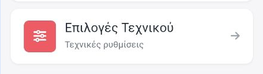
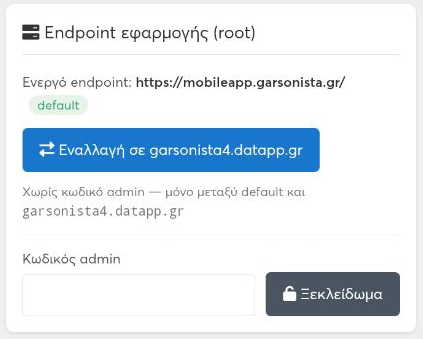
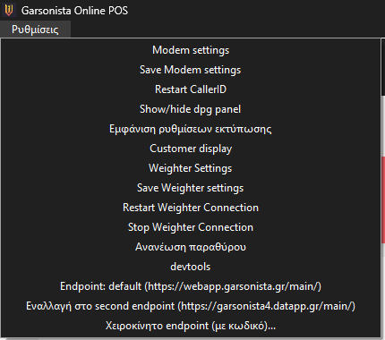

# Εγχειρίδιο — Εφεδρικά endpoints (garsonista4) στο Android app & στην Cloud Ταμειακή (Windows)

> Το Garsonista app (Android) και η Cloud Ταμειακή (Windows) μιλούν με τους
> servers της Garsonista μέσω μιας διεύθυνσης — του **endpoint**. Κανονικά
> χρησιμοποιούν το **default** endpoint. Υπάρχει όμως και ένα **εφεδρικό**
> endpoint, το **garsonista4** (`garsonista4.datapp.gr`), στο οποίο μπορεί να
> γυρίσει ο χρήστης **χωρίς κωδικό**, με ένα κουμπί, και να επιστρέψει στο
> default επίσης χωρίς κωδικό.
>
> Το εγχειρίδιο εξηγεί **πότε** χρειάζεται η εναλλαγή, **πώς** γίνεται σε κάθε
> εφαρμογή, πώς βλέπεις ποιο endpoint είναι ενεργό, και πώς ένας τεχνικός
> ορίζει οποιοδήποτε άλλο endpoint με κωδικό.

---

## 1. Τι είναι τα endpoints και γιατί υπάρχει εφεδρικό

| Endpoint | Android app | Cloud Ταμειακή (Windows) | Πότε |
|---|---|---|---|
| **Default** | `mobileapp.garsonista.gr` | `webapp.garsonista.gr` | Πάντα, εκτός αν υπάρχει πρόβλημα |
| **Εφεδρικό (garsonista4)** | `garsonista4.datapp.gr` | `garsonista4.datapp.gr` | Όταν το default «δεν βρίσκεται» ενώ το internet δουλεύει |

Το **garsonista4** παίζει πίσω από **load balancer** και είναι σχεδιασμένο ως
εφεδρεία. Δεν είναι «δοκιμαστικό» — είναι η ίδια υπηρεσία, τα ίδια δεδομένα,
ίδιοι λογαριασμοί. Ό,τι κάνεις εκεί (παραγγελίες, αποδείξεις) είναι κανονικό.

### 1.1 Πότε χρειάζεται

Σε κάποιους πελάτες το internet έρχεται από **Starlink** ή από παρόχους όπου
**πολλοί συνδρομητές μοιράζονται την ίδια δημόσια IP**. Σε τέτοιες συνδέσεις
συμβαίνει, για μικρά χρονικά διαστήματα, η συσκευή να **μη βρίσκει τη
διεύθυνση (DNS)** του default endpoint: η εφαρμογή δείχνει «χωρίς σύνδεση» ή
«σφάλμα δικτύου», ενώ άλλες σελίδες/εφαρμογές ανοίγουν κανονικά. Σε αυτές τις
περιπτώσεις το **garsonista4 παίζει καλύτερα** — γύρνα σε αυτό και δούλεψε
κανονικά.

Συμπτώματα που δείχνουν ότι αξίζει η εναλλαγή:

- Το app/η ταμειακή δείχνει «Σφάλμα σύνδεσης» ή «δεν βρέθηκε ο server», αλλά
  το YouTube/Google/Viber στην ίδια συσκευή δουλεύουν.
- Το πρόβλημα **έρχεται και φεύγει** μέσα σε λίγα λεπτά, χωρίς να άλλαξε κάτι.
- Η σύνδεση είναι Starlink, κινητό internet (4G/5G router) ή δορυφορική.

Αν **τίποτα** δεν ανοίγει στη συσκευή, το πρόβλημα είναι το internet — η
εναλλαγή δεν θα βοηθήσει.

### 1.2 Βασικός κανόνας

- Η εναλλαγή **default ⇄ garsonista4** γίνεται **χωρίς κωδικό**, από τον ίδιο
  τον χρήστη του καταστήματος.
- Οποιοδήποτε **άλλο** endpoint (χειροκίνητη πληκτρολόγηση) ζητά τον **κωδικό
  τεχνικού** — αυτό είναι δουλειά του τεχνικού [ΤΕΧΝΙΚΟΣ].
- Όταν το πρόβλημα με το default περάσει, μπορείς να **επιστρέψεις στο
  default** ή να μείνεις στο garsonista4 — και τα δύο δουλεύουν.

---

## 2. Android app (Garsonista Παραγγελιοληψία)

### 2.1 Πού βρίσκεται η ρύθμιση

1. Άνοιξε το μενού της εφαρμογής και επίλεξε **«Επιλογές Τεχνικού»** (Τεχνικές
   ρυθμίσεις).

   

2. Κατέβα στην ενότητα **«Endpoint εφαρμογής (root)»**.
3. Στην πρώτη γραμμή βλέπεις το **«Ενεργό endpoint:»** με τη διεύθυνση και μια
   ένδειξη δίπλα:
   - **«default»** (πράσινη) → δουλεύεις στο κανονικό endpoint.
   - **«custom (localStorage)»** (πορτοκαλί) → δουλεύεις σε άλλο endpoint
     (garsonista4 ή χειροκίνητο).

   

### 2.2 Εναλλαγή στο garsonista4 (χωρίς κωδικό)

1. Στην ενότητα «Endpoint εφαρμογής (root)», ακριβώς **πάνω από** το πεδίο
   «Κωδικός admin», υπάρχει το μπλε κουμπί **«Εναλλαγή σε garsonista4.datapp.gr»**.
2. Πάτησέ το. Εμφανίζεται μήνυμα «Εναλλαγή στο endpoint: https://garsonista4.datapp.gr/ —
   Να γίνει επανεκκίνηση της εφαρμογής τώρα;».
3. Πάτησε **«Επανεκκίνηση»**. Η εφαρμογή ξαναφορτώνει και συνδέεται στο
   garsonista4. Αν πατήσεις «Αργότερα», η αλλαγή έχει αποθηκευτεί αλλά θα
   ισχύσει στην επόμενη επανεκκίνηση της εφαρμογής.
4. Κάνε login κανονικά, με τα ίδια στοιχεία.

Μετά την εναλλαγή, στην ίδια οθόνη το κουμπί γράφει πλέον
**«Επαναφορά default (mobileapp.garsonista.gr)»** και η ένδειξη δείχνει
«custom (localStorage)».

### 2.3 Επιστροφή στο default (χωρίς κωδικό)

1. Μενού → «Επιλογές Τεχνικού» → «Endpoint εφαρμογής (root)».
2. Πάτησε **«Επαναφορά default (mobileapp.garsonista.gr)»**.
3. Στο μήνυμα πάτησε **«Επανεκκίνηση»**.

Το κουμπί δουλεύει **μόνο** ανάμεσα στο default και στο garsonista4. Αν ένας
τεχνικός έχει ορίσει άλλο, χειροκίνητο endpoint, το ίδιο κουμπί γράφει
«Εναλλαγή σε garsonista4.datapp.gr» και το χειροκίνητο επιστρέφει στο default
μόνο μέσα από το ξεκλείδωμα με κωδικό (ενότητα 4).

### 2.4 Τι μένει και τι όχι

- Η επιλογή endpoint **αποθηκεύεται στη συσκευή** — μένει και μετά από
  κλείσιμο/άνοιγμα της εφαρμογής ή επανεκκίνηση της συσκευής.
- **Δεν** χάνονται παραγγελίες ή ρυθμίσεις: το garsonista4 είναι η ίδια
  υπηρεσία.
- Η ρύθμιση είναι **ανά συσκευή**: αν έχεις 3 tablets, η εναλλαγή γίνεται σε
  καθένα ξεχωριστά.

---

## 3. Cloud Ταμειακή (Windows — Garsonista Online POS)

### 3.1 Πού βρίσκεται η ρύθμιση

Η Cloud Ταμειακή είναι το πρόγραμμα **Garsonista Online POS** που εγκαθίσταται
στα Windows (δες [GARSONISTA_INSTALLATION.md](GARSONISTA_INSTALLATION.md)).
Στο πάνω μενού του προγράμματος, άνοιξε το **«Ρυθμίσεις»**. Στο **τέλος** της
λίστας υπάρχουν τρεις γραμμές:

- **«Endpoint: default (…)»** / **«Endpoint: second (…)»** /
  **«Endpoint: χειροκίνητο (…)»** — ενημερωτική γραμμή (δεν πατιέται) που
  δείχνει ποιο endpoint είναι ενεργό αυτή τη στιγμή.
- **«Εναλλαγή στο second endpoint (https://garsonista4.datapp.gr/main/)»** ή
  **«Εναλλαγή στο default endpoint»** — το κουμπί εναλλαγής χωρίς κωδικό.
- **«Χειροκίνητο endpoint (με κωδικό)…»** — για τεχνικούς (ενότητα 4).

### 3.2 Εναλλαγή στο garsonista4 (χωρίς κωδικό)

1. «Ρυθμίσεις» → **«Εναλλαγή στο second endpoint (https://garsonista4.datapp.gr/main/)»**.
2. Εμφανίζεται ερώτηση «Το endpoint θα αλλάξει σε: … Η σελίδα θα ξαναφορτωθεί
   στο νέο endpoint. Συνέχεια;». Πάτησε **«Yes»**.
3. **Δεν κλείνει το πρόγραμμα** — απλώς ξαναφορτώνει η σελίδα της ταμειακής στο
   garsonista4. Οι εκτυπωτές, η οθόνη πελάτη και η αναγνώριση κλήσεων
   συνεχίζουν κανονικά.
4. Κάνε login κανονικά.

Μετά την εναλλαγή η ενημερωτική γραμμή γράφει «Endpoint: second (…)» και το
κουμπί γίνεται **«Εναλλαγή στο default endpoint»**.

### 3.3 Επιστροφή στο default (χωρίς κωδικό)

1. «Ρυθμίσεις» → **«Εναλλαγή στο default endpoint»**.
2. **«Yes»** στην ερώτηση. Η σελίδα ξαναφορτώνει στο `webapp.garsonista.gr`.

Σε αντίθεση με το Android app, εδώ το κουμπί «Εναλλαγή στο default endpoint»
εμφανίζεται **και** όταν είναι ενεργό χειροκίνητο endpoint — δηλαδή ο χρήστης
μπορεί πάντα να γυρίσει στο default χωρίς κωδικό.

### 3.4 Πού αποθηκεύεται

Η επιλογή γράφεται στο αρχείο **`defurl.txt`** μέσα στον φάκελο εγκατάστασης
της ταμειακής (η **πρώτη γραμμή** του αρχείου είναι το ενεργό endpoint· **κενό
αρχείο = default**). Έτσι, στην επόμενη εκκίνηση του προγράμματος ανοίγει
ξανά το ίδιο endpoint. Δεν χρειάζεται να ανοίξεις το αρχείο με το χέρι — το
διαχειρίζεται το μενού.

---

## 4. Χειροκίνητο endpoint [ΤΕΧΝΙΚΟΣ]

Οποιαδήποτε διεύθυνση **εκτός** από default/garsonista4 ορίζεται μόνο με τον
**κωδικό τεχνικού** (ίδιος κωδικός και στις δύο εφαρμογές — τον δίνει η
Semantic, δεν αναγράφεται εδώ).

### 4.1 Android app

1. «Επιλογές Τεχνικού» → «Endpoint εφαρμογής (root)».
2. Πληκτρολόγησε τον κωδικό στο πεδίο **«Κωδικός admin»** και πάτησε
   **«Ξεκλείδωμα»**. Με λάθος κωδικό εμφανίζεται «Λάθος κωδικός admin».
3. Στο πεδίο **«Custom root»** γράψε τη διεύθυνση (πρέπει να ξεκινά με
   `http://` ή `https://`). Κενό πεδίο = default.
4. **«Αποθήκευση»** → «Επανεκκίνηση». Το **«Επαναφορά default»** μέσα στη
   φόρμα σβήνει το χειροκίνητο endpoint και γυρίζει στο default.

### 4.2 Cloud Ταμειακή (Windows)

1. «Ρυθμίσεις» → **«Χειροκίνητο endpoint (με κωδικό)…»**.
2. Δώσε τον κωδικό στο παράθυρο «Κωδικός:» και πάτησε **«OK»**. Με λάθος
   κωδικό εμφανίζεται «Λάθος κωδικός.» και τίποτα δεν αλλάζει.
3. Στο επόμενο παράθυρο γράψε τη διεύθυνση (προσυμπληρωμένη με την τρέχουσα).
   **«Cancel»/«Άκυρο»** = ακύρωση χωρίς καμία αλλαγή. **«OK»** → ερώτηση
   επιβεβαίωσης → **«Yes»** → η σελίδα ξαναφορτώνει στο νέο endpoint.
4. Η διεύθυνση πρέπει να ξεκινά με `http://` ή `https://` — αλλιώς εμφανίζεται
   μήνυμα και δεν αποθηκεύεται.

Για επιστροφή στο default από χειροκίνητο endpoint δεν χρειάζεται κωδικός:
«Ρυθμίσεις» → «Εναλλαγή στο default endpoint».

---

## 5. Συχνά προβλήματα & λύσεις

| Σύμπτωμα | Αιτία | Λύση |
|---|---|---|
| Το app δείχνει «Σφάλμα σύνδεσης», αλλά το internet της συσκευής δουλεύει | Το default endpoint δεν «βρίσκεται» προσωρινά (DNS — συχνό σε Starlink/κοινόχρηστη IP) | Εναλλαγή στο garsonista4 (ενότητα 2.2 / 3.2) |
| Πάτησα «Εναλλαγή» αλλά το app δείχνει ακόμη το παλιό endpoint | Στο Android δεν έγινε «Επανεκκίνηση» | Κλείσε τελείως και ξανάνοιξε την εφαρμογή, ή πάτησε ξανά το κουμπί και επίλεξε «Επανεκκίνηση» |
| Στην ταμειακή μετά την εναλλαγή δεν φορτώνει η σελίδα | Ούτε το garsonista4 είναι προσβάσιμο — πρόβλημα internet | Έλεγξε τη σύνδεση (router/Starlink). Αν χρειάζεται, «Ρυθμίσεις» → «Ανανέωση παραθύρου» |
| Το κουμπί λέει «Εναλλαγή σε garsonista4» ενώ η ένδειξη είναι «custom» (Android) | Είναι ενεργό χειροκίνητο endpoint που όρισε τεχνικός | Μπορείς να πας στο garsonista4 χωρίς κωδικό· για default χρειάζεται ξεκλείδωμα με κωδικό |
| Το «Ξεκλείδωμα» λέει «Λάθος κωδικός admin» | Λάθος ή κενός κωδικός | Ο κωδικός είναι μόνο για τεχνικούς — η εναλλαγή default ⇄ garsonista4 δεν τον χρειάζεται |
| Η ταμειακή ανοίγει σε λάθος endpoint μετά από επανεγκατάσταση | Το `defurl.txt` του παλιού φακέλου έχει άλλη διεύθυνση | «Ρυθμίσεις» → «Εναλλαγή στο default endpoint» |
| Σε ένα από τα tablets το app δουλεύει και σε άλλο όχι | Η ρύθμιση είναι ανά συσκευή | Κάνε την εναλλαγή σε κάθε συσκευή που έχει πρόβλημα |

---

## 6. Για τεχνικούς [ΤΕΧΝΙΚΟΣ]

- **Ίδια υπηρεσία, ίδια δεδομένα.** Το garsonista4 δεν είναι ξεχωριστή
  εγκατάσταση — δείχνει στους ίδιους servers μέσω load balancer. Δεν
  «μεταφέρεται» τίποτα κατά την εναλλαγή.
- **Πότε το προτείνουμε μόνιμα:** πελάτες με Starlink, δορυφορικό ή κινητό
  internet (4G/5G router) όπου οι διακοπές DNS επαναλαμβάνονται. Μπορεί να
  μείνει μόνιμα στο garsonista4 χωρίς μειονέκτημα.
- **Android:** η ρύθμιση αποθηκεύεται τοπικά στη συσκευή και διαβάζεται στην
  εκκίνηση της εφαρμογής, πριν από κάθε επικοινωνία με τον server. Δεν
  επηρεάζεται από τους μηχανισμούς replica/εναλλακτικών servers της
  εφαρμογής. Απεγκατάσταση της εφαρμογής = επιστροφή στο default.
- **Windows:** η πρώτη γραμμή του `defurl.txt` (φάκελος εγκατάστασης) είναι το
  URL που φορτώνει ο browser της ταμειακής. Η εναλλαγή **αντικαθιστά όλο το
  περιεχόμενο** του αρχείου με μία γραμμή (ή το αδειάζει). Αν είχες βάλει
  παραμέτρους στο URL (π.χ. έκδοση προγράμματος), ξαναβάλ' τες μέσω
  «Χειροκίνητο endpoint (με κωδικό)…».
- **Windows — χωρίς επανεκκίνηση:** η εναλλαγή κάνει μόνο reload της σελίδας.
  Το [Web Print Service](WEB_PRINT_SERVICE.md), οι εκτυπωτές (`defparams.txt`
  — βλ. [PRINTER_DRIVER_TP80K.md](PRINTER_DRIVER_TP80K.md)), η
  [Αναγνώριση Κλήσεων](CALLER_ID.md), η οθόνη πελάτη και η ζυγαριά δεν
  επηρεάζονται — το endpoint αφορά μόνο τη σελίδα της ταμειακής.
- **Σχετικά εγχειρίδια:** εγκατάσταση της Cloud Ταμειακής στο
  [GARSONISTA_INSTALLATION.md](GARSONISTA_INSTALLATION.md)· εκτυπώσεις που
  «σταματούν» σε πρόβλημα σύνδεσης στο [WEB_PRINT_SERVICE.md](WEB_PRINT_SERVICE.md)
  (οι εκκρεμείς εκτυπώσεις βγαίνουν μόλις επανέλθει η επικοινωνία με τον server).
- **Ο κωδικός τεχνικού** είναι κοινός για Android και Windows και **δεν
  γράφεται σε εγχειρίδια ή μηνύματα προς πελάτες**. Αν ζητηθεί από πελάτη,
  δίνεται μόνο τηλεφωνικά από τη Semantic.
- **Πριν την εναλλαγή σε πελάτη με πρόβλημα:** έλεγξε πρώτα ότι άλλες σελίδες
  ανοίγουν στη συσκευή. Αν δεν ανοίγει τίποτα, το πρόβλημα είναι το δίκτυο
  και η εναλλαγή δεν θα το λύσει.
