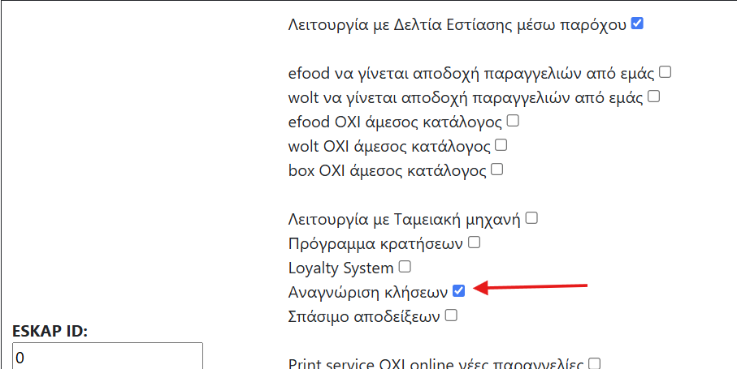
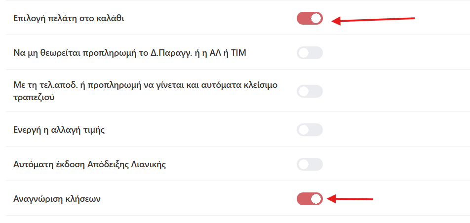
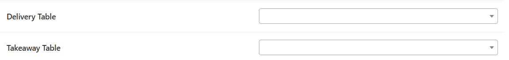
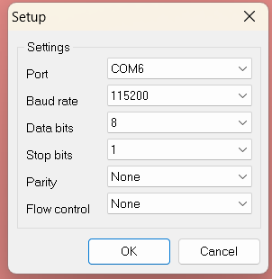

# Εγχειρίδιο — Αναγνώριση Κλήσεων (Caller ID)

> Διαδικασία ενεργοποίησης αναγνώρισης κλήσης σε εγκατάσταση με **Web Print
> Service**: όταν χτυπάει το σταθερό του καταστήματος, η κλήση εμφανίζεται στην
> παραγγελιοληψία Garsonista, ο πελάτης αναγνωρίζεται από το τηλέφωνό του, και
> ο χρήστης μεταφέρεται αυτόματα στην εισαγωγή νέας παραγγελίας.
>
> **Ολόκληρη η διαδικασία είναι [ΤΕΧΝΙΚΟΣ]** — τη στήνει ο τεχνικός Garsonista
> στο PC του καταστήματος όπου τρέχει το Garsonista Windows app (Web Print
> Service).

---

## 1. Πώς δουλεύει (σε μια ματιά)

- Στο PC του Web Print Service συνδέεται μία **πηγή αναγνώρισης κλήσης**:
  είτε **USB modem** πάνω στην τηλεφωνική γραμμή (Μέθοδος Α), είτε το ίδιο το
  **router** (Fritzbox ή Oxygen/Cosmote — Μέθοδος Β).
- Το βοηθητικό πρόγραμμα αναγνώρισης καταγράφει κάθε εισερχόμενη κλήση, και το
  Garsonista τη διαβάζει και την εμφανίζει στην εφαρμογή.
- Αν ο αριθμός υπάρχει στο αρχείο πελατών, ο πελάτης έρχεται **προεπιλεγμένος**·
  ο χρήστης, όπου κι αν βρίσκεται μέσα στην εφαρμογή, μεταφέρεται **αυτόματα
  στο παράθυρο εισαγωγής νέας παραγγελίας**.

---

## 2. Βήμα 1 — Ενεργοποίηση στον πελάτη (adminpanel)

Στο **admin_panel**, στην καρτέλα του πελάτη, ενεργοποιούμε την επιλογή
**«Αναγνώριση κλήσεων»**:

---

## 3. Βήμα 2 — Ρυθμίσεις χρηστών

Στη **Διαχείριση Χρηστών**, στους χρήστες που θα δουλεύουν με αναγνώριση,
ενεργοποιούμε:

- **«Αναγνώριση κλήσεων»**
- **«Επιλογή πελάτη στο καλάθι»**

Επίσης, στον ίδιο χρήστη ορίζουμε τα τραπέζια **«Delivery Table»** και
**«Takeaway Table»**. Με ορισμένα αυτά τα τραπέζια, κατά την αναγνώριση
κλήσης — όπου και να βρίσκεται ο χρήστης μέσα στην εφαρμογή — θα μεταβαίνει
**αυτόματα** στο παράθυρο εισαγωγής νέας παραγγελίας:

---

## 4. Μέθοδος Α — Αναγνώριση κλήσεων με Modem

1. **Εγκατάσταση του modem** στο PC όπου έχει εγκατασταθεί και το Garsonista
   Web Print Service. Στα δικά μας modem, η εγκατάσταση σε Windows 10 & 11
   γίνεται **αυτόματα** μόλις συνδεθεί στο USB. Στην άλλη πλευρά του modem
   κουμπώνουμε τηλεφωνικό καλώδιο — σαν να ήταν κανονική σταθερή συσκευή.
2. Ανοίγουμε τη **«Διαχείριση Συσκευών»** των Windows, βρίσκουμε το modem και
   με δεξί κλικ → **«Ιδιότητες»** βλέπουμε σε ποια **θύρα COM** το
   αντιστοίχισε το σύστημα και με τι **BAUD RATE** δουλεύει. Το BAUD RATE
   είναι σχεδόν πάντα **115200** — η θύρα COM όμως είναι εντελώς τυχαία.
3. Στον φάκελο του Garsonista πρέπει να υπάρχει το αρχείο **`phone_calls.ini`**.
   Αν δεν υπάρχει, δημιουργούμε ένα νέο, **εντελώς κενό**. Επίσης, μέσα στο
   αρχείο **`defparams.txt`** βάζουμε `active_sql=0`.
4. Ανοίγουμε το Garsonista και από τις **«Ρυθμίσεις»** (πάνω αριστερά)
   επιλέγουμε **«modem settings»** (πρώτη επιλογή). Στο παράθυρο Setup βάζουμε
   τη **θύρα COM** του modem και το **BAUD RATE** (σχεδόν πάντα 115200) και
   πατάμε **OK**:

   

5. Ξανά από τις «Ρυθμίσεις» πατάμε τη δεύτερη επιλογή **«Save modem settings»**
   και τέλος **«Restart caller ID»**. Μετά το «Restart caller ID», κάτω-κάτω
   στη γκρι μπάρα της εφαρμογής θα εμφανιστεί το μήνυμα **«ΟΚ»**.
6. **Κλείνουμε και ανοίγουμε ξανά την εφαρμογή.** Η αναγνώριση κλήσεων έχει
   ενεργοποιηθεί.

---

## 5. Μέθοδος Β — Αναγνώριση κλήσεων με Router (Fritzbox / Oxygen)

1. **Fritzbox μόνο**: για την ενεργοποίηση του CallerID API του router, από το
   σταθερό τηλέφωνο που είναι συνδεδεμένο πάνω του πραγματοποιούμε μία κλήση
   στο: **`#96*5*`**
2. Κατεβάζουμε το πακέτο εργαλείων αναγνώρισης από τον φάκελο εργαλείων της
   ομάδας (zip):
   https://drive.google.com/file/d/1FaOzh58PLmfA7lbJZqwN58SQz7owswzO/view?usp=sharing
   και το αποσυμπιέζουμε. Τα περιεχόμενα του αρχείου τα κάνουμε **αντιγραφή-
   επικόλληση με αντικατάσταση** στον φάκελο του προγράμματος — εκεί όπου
   βρίσκεται το `JSExtension.exe`.
3. Επεξεργαζόμαστε το αρχείο **`phoneCalls/defparams.txt`**:
   - `isfritzbox=1` αν το router είναι **Fritzbox**, `isfritzbox=0` αν είναι
     **Oxygen (Cosmote)**
   - στο `aurl` βάζουμε την **IP του router**
   - στο `aurl_oxygen` αντικαθιστούμε το προσυμπληρωμένο `user:password` με τα
     **στοιχεία σύνδεσης του oxygen router** του πελάτη
   - στο `mynumber` βάζουμε τον **αριθμό του σταθερού** τηλεφώνου
4. Δημιουργούμε **συντόμευση του `PhoneCalls.exe`** στον φάκελο **startup**
   των Windows, ώστε το πρόγραμμα αναγνώρισης να ανοίγει αυτόματα με τα
   Windows. Μία ακόμη συντόμευση βάζουμε και στην **επιφάνεια εργασίας**.
   - Για να ανοίξουμε τον φάκελο startup: **{Windows}+{R}** → γράφουμε
     **`shell:startup`** → Enter — και ρίχνουμε εκεί μέσα τη συντόμευση.

---

## 6. Πώς φαίνεται στη χρήση

- Με κάθε εισερχόμενη κλήση, η εφαρμογή εμφανίζει την κλήση και ψάχνει τον
  αριθμό στο αρχείο πελατών.
- Ο χρήστης μεταφέρεται αυτόματα στην εισαγωγή νέας παραγγελίας (στο Delivery
  ή Takeaway τραπέζι που ορίστηκε), με τον πελάτη προεπιλεγμένο στο καλάθι —
  έτοιμος να χτυπήσει την παραγγελία όσο μιλάει.
- Αν ο αριθμός δεν αντιστοιχεί σε πελάτη, ο χρήστης μπορεί να τον καταχωρήσει
  ως νέο πελάτη εκείνη τη στιγμή.

---

## 7. Συχνά προβλήματα & λύσεις

| Σύμπτωμα | Αιτία | Λύση |
|---|---|---|
| Δεν εμφανίζονται καθόλου κλήσεις | Δεν είναι ενεργή η «Αναγνώριση κλήσεων» στον πελάτη (adminpanel) ή στον χρήστη | Έλεγξε τα Βήματα 1-2 (και επανασύνδεση χρήστη) |
| Modem: δεν έρχονται κλήσεις | Λάθος θύρα COM ή BAUD RATE | Δες τη «Διαχείριση Συσκευών» για τη σωστή COM, ξαναπέρασέ τη στα «modem settings» → «Save modem settings» → «Restart caller ID» → restart εφαρμογής |
| Modem: μετά το «Restart caller ID» δεν βγήκε «ΟΚ» στη μπάρα | Το modem δεν αποκρίνεται στη θύρα | Δοκίμασε άλλη θύρα USB (η COM μπορεί να αλλάξει!), επανέλεγξε στη Διαχείριση Συσκευών |
| Fritzbox: δεν στέλνει κλήσεις | Δεν ενεργοποιήθηκε το CallerID API | Κάνε την κλήση **#96*5*** από σταθερό συνδεδεμένο πάνω στο router |
| Oxygen: δεν στέλνει κλήσεις | Λάθος IP ή στοιχεία σύνδεσης στο defparams.txt | Έλεγξε `aurl` (IP router) και `aurl_oxygen` (user:password) |
| Δούλευε και σταμάτησε μετά από επανεκκίνηση PC | Το PhoneCalls.exe δεν άνοιξε | Έλεγξε ότι η συντόμευση υπάρχει στο `shell:startup` — άνοιξέ το χειροκίνητα από την επιφάνεια εργασίας για άμεση επαναφορά |
| Η κλήση φαίνεται αλλά δεν ανοίγει η εισαγωγή παραγγελίας | Δεν έχουν οριστεί Delivery/Takeaway Table στον χρήστη | Όρισέ τα στη Διαχείριση Χρηστών (Βήμα 2) |
| Ο πελάτης δεν προεπιλέγεται στο καλάθι | Ανενεργή η «Επιλογή πελάτη στο καλάθι», ή ο αριθμός δεν υπάρχει στο αρχείο πελατών | Ενεργοποίησε τη ρύθμιση· καταχώρησε τον πελάτη με το τηλέφωνό του |

---

## 8. Για τεχνικούς — extra [ΤΕΧΝΙΚΟΣ]

- Η αναγνώριση δουλεύει **χωρίς βάση/SQL στο PC**: το πρόγραμμα αναγνώρισης
  γράφει τις κλήσεις σε αρχεία, και το Garsonista τα διαβάζει από εκεί
  (κρατιούνται τα τελευταία 3 ημερών). Γι' αυτό και το `active_sql=0`.
- Το στήσιμο γίνεται στο **ίδιο PC με το Web Print Service** — μία
  εγκατάσταση, ένα σημείο ελέγχου.
- Μετά από κάθε αλλαγή σε modem settings ή defparams: **restart της
  εφαρμογής** (και του PhoneCalls.exe στη Μέθοδο Β).
