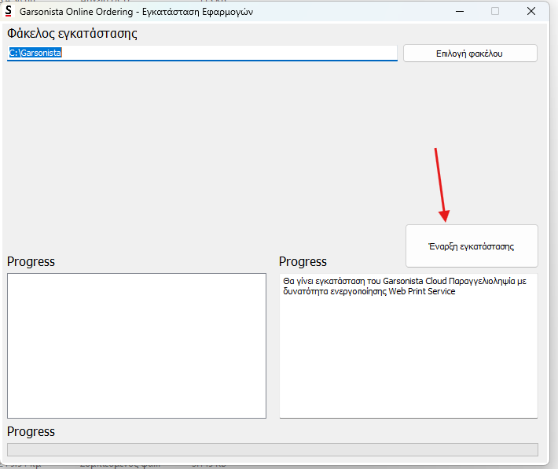

# Εγχειρίδιο — Εγκατάσταση Garsonista Online Παραγγελιοληψία

> Πώς εγκαθίσταται στο PC του καταστήματος το **Garsonista Online
> Παραγγελιοληψία** — ισχύει και για τις δύο εκδόσεις:
>
> - **Cloud Ταμειακή**
> - **Παραγγελιοληψία με Web Print Service**
>
> Ο ίδιος installer καλύπτει και τις δύο: εγκαθιστά το Garsonista Cloud
> Παραγγελιοληψία **με δυνατότητα ενεργοποίησης Web Print Service**.
> Η εγκατάσταση είναι υπόθεση 2-3 λεπτών και ουσιαστικά ενός κουμπιού.

---

## 1. Τι θα χρειαστείς

- PC με **Windows** (το PC όπου θα δουλεύει η παραγγελιοληψία — και, για την
  έκδοση με Web Print Service, εκεί όπου θα «κουμπώσουν» οι εκτυπωτές).
- Δικαιώματα **διαχειριστή** στο PC (η εκτέλεση γίνεται «ως διαχειριστής»).
- Σύνδεση στο internet.

---

## 2. Κατέβασμα του installer

Κατέβασε το αρχείο **Garsonista_installer.zip** από εδώ:

**➜ [Garsonista_installer.zip](https://github.com/semantic-software/garsonista_user_manuals/releases/download/installer/Garsonista_installer.zip)**

Το zip περιέχει το πρόγραμμα εγκατάστασης **SemanticInstaller.exe** (μαζί με
τα απαραίτητα συνοδευτικά αρχεία του).

---

## 3. Βήματα εγκατάστασης

1. **Αποσυμπίεσε** το `Garsonista_installer.zip` **οπουδήποτε** (π.χ. στην
   Επιφάνεια εργασίας ή στις Λήψεις) — δεξί κλικ → «Εξαγωγή όλων…».
2. Μέσα στον φάκελο που βγήκε, κάνε **δεξί κλικ στο `SemanticInstaller.exe`**
   και επίλεξε **«Εκτέλεση ως διαχειριστής»**.
3. Ανοίγει το παράθυρο **«Garsonista Online Ordering — Εγκατάσταση
   Εφαρμογών»**:
   - **«Φάκελος εγκατάστασης»**: προτεινόμενος ο `C:\Garsonista` — άφησέ τον
     ως έχει (ή άλλαξέ τον με το κουμπί **«Επιλογή φακέλου»** αν χρειάζεται).
   - Στο δεξί πλαίσιο Progress γράφει τι θα γίνει: «Θα γίνει εγκατάσταση του
     Garsonista Cloud Παραγγελιοληψία με δυνατότητα ενεργοποίησης Web Print
     Service».
4. Πάτησε **«Έναρξη εγκατάστασης»**:

   

5. Περίμενε να ολοκληρωθεί η πρόοδος (τα πλαίσια Progress γεμίζουν με τα
   βήματα/αρχεία). Αυτό ήταν — η εγκατάσταση ολοκληρώθηκε.

---

## 4. Μετά την εγκατάσταση

- **Cloud Ταμειακή**: άνοιξε την εφαρμογή και συνδέσου με τα στοιχεία του
  καταστήματος που έχει δώσει η Garsonista.
- **Παραγγελιοληψία με Web Print Service**: η **ενεργοποίηση** του Web Print
  Service γίνεται από τον admin (τεχνικό Garsonista) στο adminpanel,
  επιλέγοντας τον χρήστη που θα είναι συνδεδεμένος στην εφαρμογή — δες
  αναλυτικά το εγχειρίδιο
  [WEB_PRINT_SERVICE.md](WEB_PRINT_SERVICE.md).
- Αν το κατάστημα θα έχει και **αναγνώριση κλήσεων**, το στήσιμο γίνεται στο
  ίδιο PC — δες το εγχειρίδιο [CALLER_ID.md](CALLER_ID.md).

---

## 5. Συχνά προβλήματα & λύσεις

| Σύμπτωμα | Αιτία | Λύση |
|---|---|---|
| Τα Windows εμφανίζουν μπλε προειδοποίηση SmartScreen στο άνοιγμα | Προστασία των Windows για προγράμματα εκτός Store | Πάτησε «Περισσότερες πληροφορίες» → «Εκτέλεση όπως και να 'χει» |
| «Δεν έχετε δικαιώματα» / η εγκατάσταση αποτυγχάνει στη μέση | Δεν έτρεξε ως διαχειριστής | Κλείσε το παράθυρο και ξανατρέξε το `SemanticInstaller.exe` με **δεξί κλικ → «Εκτέλεση ως διαχειριστής»** |
| Το antivirus «κρατάει» ή σβήνει το αρχείο | Ψευδής συναγερμός σε νέο installer | Βάλε εξαίρεση στον φάκελο του installer (ή/και στον φάκελο εγκατάστασης `C:\Garsonista`) και ξανακατέβασε το zip |
| Διπλό κλικ στο zip και «δεν τρέχει τίποτα» | Το exe εκτελέστηκε μέσα από το zip χωρίς αποσυμπίεση | Κάνε πρώτα **«Εξαγωγή όλων…»** και τρέξε το exe από τον αποσυμπιεσμένο φάκελο |
| Η εγκατάσταση κόλλησε χωρίς πρόοδο | Διακοπή σύνδεσης internet | Έλεγξε τη σύνδεση, κλείσε το παράθυρο και ξανατρέξε τον installer — είναι ασφαλές να επαναληφθεί |

---

## 6. Για τεχνικούς [ΤΕΧΝΙΚΟΣ]

- **Ένας installer, δύο εκδόσεις**: το τι θα δουλέψει το κατάστημα (Cloud
  Ταμειακή ή Παραγγελιοληψία με Web Print Service) καθορίζεται από τις
  ενεργοποιήσεις στο adminpanel — όχι από διαφορετικό installer.
- **Φάκελος εγκατάστασης**: κράτα τον προεπιλεγμένο `C:\Garsonista` εκτός αν
  υπάρχει λόγος — τα υπόλοιπα εγχειρίδια (Web Print Service, Caller ID) τον
  θεωρούν δεδομένο.
- **Επανεγκατάσταση/ενημέρωση**: ξανατρέχεις τον installer με τον ίδιο
  φάκελο εγκατάστασης.
- Ο installer διανέμεται από τη σελίδα
  [Releases](https://github.com/semantic-software/garsonista_user_manuals/releases/tag/installer)
  του repo των εγχειριδίων — πάντα από εκεί, όχι από τοπικά αντίγραφα που
  κυκλοφορούν.
