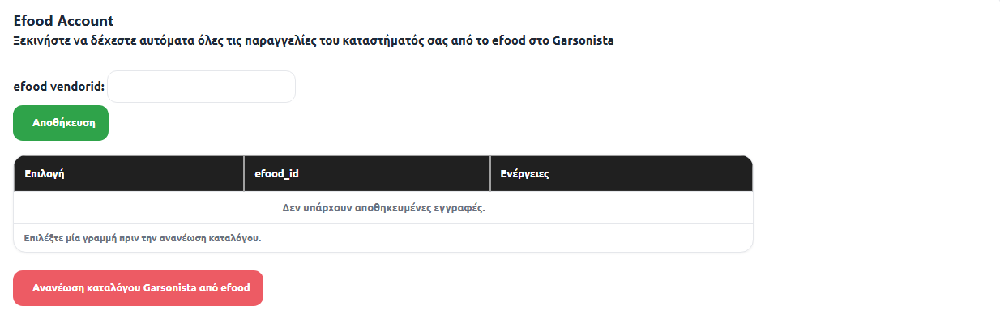
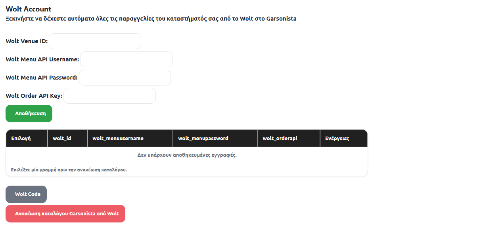
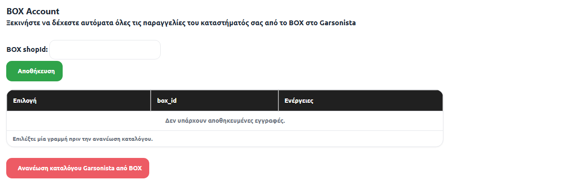

# Εγχειρίδιο — Διασύνδεση με efood / Wolt / Box

> Το Garsonista διασυνδέεται με τις πλατφόρμες παραγγελιοληψίας **efood**,
> **Wolt** και **Box**. Οι παραγγελίες από τις τρεις πλατφόρμες πέφτουν —
> αυτόματα ή με χειροκίνητη αποδοχή, ανάλογα με τη ρύθμιση — μέσα στο
> Garsonista, και το κατάστημα διαχειρίζεται στην πράξη **μία πλατφόρμα αντί
> για τρεις**: ένα σημείο για αποδοχή, ετοιμασία, εκτύπωση και έκδοση
> απόδειξης.

---

## 1. Πώς δουλεύει (σε μια ματιά)

- Η επιχείρηση κρατάει τους λογαριασμούς της στις πλατφόρμες όπως και πριν —
  το Garsonista «γεφυρώνεται» με αυτούς με τα κλειδιά (credentials) κάθε
  πλατφόρμας.
- Κάθε πλατφόρμα αποκτά το **δικό της τραπέζι** μέσα στο Garsonista· οι
  παραγγελίες της πέφτουν αυτόματα εκεί και τυπώνονται στα παραγγελιόχαρτα
  όπως όλες οι άλλες.
- Η πορεία της παραγγελίας (ΕΤΟΙΜΗ → ΠΑΡΑΔΟΘΗΚΕ) και η **αυτόματη έκδοση της
  τελικής απόδειξης** γίνονται μέσα από τη σελίδα παραγγελιών delivery του
  Garsonista.

---

## 2. Ενεργοποίηση διασύνδεσης [ΤΕΧΝΙΚΟΣ]

> Το βήμα αυτό γίνεται **αποκλειστικά από την τεχνική ομάδα Garsonista, μέσα
> από το ComID (adminpanel)** — δεν είναι ενέργεια του καταστήματος.

1. Είσοδος στο **ComID**.
2. Στην καρτέλα του πελάτη υπάρχουν, σε μορφή checkbox — όπως και οι
   υπόλοιπες ρυθμίσεις — οι τρεις επιλογές: **«efood»**, **«Wolt»**, **«Box»**.
3. Με το check σε οποιαδήποτε από τις τρεις, εμφανίζονται από κάτω οι
   υποεπιλογές της:
   - efood: checkbox **«efood να γίνεται αποδοχή παραγγελιών από εμάς»**
   - Wolt: checkbox **«Wolt να γίνεται αποδοχή παραγγελιών από εμάς»**
   - Box: **δεν** υπάρχει αντίστοιχη επιλογή αποδοχής (βλ. παρακάτω γιατί)
   - Και στις τρεις εμφανίζεται επιπλέον το checkbox **«ΟΧΙ άμεσος κατάλογος»**
4. Προεπιλογές (defaults) με το check μιας πλατφόρμας:
   - **«ΟΧΙ άμεσος κατάλογος» → ΕΝΕΡΓΟ** εξ ορισμού
   - **«…να γίνεται αποδοχή παραγγελιών από εμάς» → ΑΝΕΝΕΡΓΟ** εξ ορισμού

### Τι σημαίνουν οι δύο επιλογές

**«…να γίνεται αποδοχή παραγγελιών από εμάς»** — καθορίζει από πού γίνεται η
αποδοχή της παραγγελίας:

- **Ανενεργό (default)**: η αποδοχή/απόρριψη γίνεται στη **συσκευή της
  πλατφόρμας** (efood/Wolt), και μόνο αφού γίνει αποδοχή εκεί η παραγγελία
  περνάει στο Garsonista. Έτσι δουλεύει το ~90% των πελατών.
- **Ενεργό**: η αποδοχή/απόρριψη γίνεται **μέσα από το Garsonista** (βλ. §7.4).
- **Box**: η αποδοχή γίνεται **πάντα** μέσα από την πλατφόρμα Box — γι' αυτό
  δεν υπάρχει η επιλογή για το Box.

**«ΟΧΙ άμεσος κατάλογος»** — κατά τη «γέφυρα» με μια πλατφόρμα υπάρχει η
δυνατότητα να περαστεί αυτόματα **ολόκληρος ο κατάλογος** προϊόντων της
πλατφόρμας στο Garsonista (περιγραφές, τιμές, φωτογραφίες, τροποποιητές).
Οι περισσότερες επιχειρήσεις όμως περνούν τον κατάλογό τους ξεχωριστά, γι'
αυτό η επιλογή είναι **ενεργή εξ ορισμού**: αυτόματη εισαγωγή καταλόγου
γίνεται **μόνο αν αφαιρεθεί** το check.

### Συγκεντρωτικός πίνακας προεπιλογών

| Πλατφόρμα | «Αποδοχή παραγγελιών από εμάς» | «ΟΧΙ άμεσος κατάλογος» |
|---|---|---|
| efood | Διαθέσιμο — default: **ΑΝΕΝΕΡΓΟ** | Διαθέσιμο — default: **ΕΝΕΡΓΟ** |
| Wolt | Διαθέσιμο — default: **ΑΝΕΝΕΡΓΟ** | Διαθέσιμο — default: **ΕΝΕΡΓΟ** |
| Box | **Μη διαθέσιμη επιλογή** | Διαθέσιμο — default: **ΕΝΕΡΓΟ** |

---

## 3. Σετάρισμα από τον χρήστη — κλειδιά πλατφορμών

Μόλις η τεχνική ομάδα ενεργοποιήσει τις πλατφόρμες, στο **Διαχειριστικό
(web)** του χρήστη εμφανίζονται — κάτω στις ρυθμίσεις, στο ίδιο σημείο με τις
ρυθμίσεις QR — οι επιλογές **«Efood»**, **«Wolt»** και **«Box»**. Το πρώτο
βήμα σε κάθε μία είναι να περαστούν τα **κλειδιά (credentials)** της
αντίστοιχης πλατφόρμας, ώστε να συνδεθεί ο λογαριασμός του καταστήματος με το
Garsonista.

### 3.1 Efood Account

Απαιτούμενο πεδίο: **«efood vendorid»**.

1. Συμπληρώνουμε το «efood vendorid» και πατάμε **«Αποθήκευση»** — η εγγραφή
   εμφανίζεται στον πίνακα από κάτω.
2. Επιλέγουμε τη γραμμή του πίνακα και πατάμε **«Ανανέωση καταλόγου
   Garsonista από efood»** για να συγχρονιστεί ο κατάλογος.

> Το efood vendorid **δεν** είναι διαθέσιμο άμεσα στον χρήστη: ζητείται **με
> email από το efood** και η απάντηση έρχεται συνήθως εντός μίας εργάσιμης
> ημέρας.

### 3.2 Wolt Account

Απαιτούμενα πεδία:

- **«Wolt Venue ID»**
- **«Wolt Menu API Username»**
- **«Wolt Menu API Password»**
- **«Wolt Order API Key»**

1. Συμπληρώνουμε τα τέσσερα πεδία και πατάμε **«Αποθήκευση»** — η εγγραφή
   εμφανίζεται στον πίνακα από κάτω.
2. Διαθέσιμα κουμπιά: **«Wolt Code»** και **«Ανανέωση καταλόγου Garsonista
   από Wolt»** για τον συγχρονισμό του καταλόγου.

> Τα στοιχεία του Wolt (Venue ID, Menu API Username/Password, Order API Key)
> ζητούνται **με email από το Wolt** — απάντηση συνήθως εντός μίας εργάσιμης
> ημέρας.

### 3.3 BOX Account

Απαιτούμενο πεδίο: **«BOX shopId»**.

1. Συμπληρώνουμε το «BOX shopId» και πατάμε **«Αποθήκευση»**.
2. Επιλέγουμε τη γραμμή και πατάμε **«Ανανέωση καταλόγου Garsonista από BOX»**.

> Σε αντίθεση με efood/Wolt, το BOX shopId λαμβάνεται **απευθείας από την
> εφαρμογή του BOX** — δεν χρειάζεται email και αναμονή.

---

## 4. Αντιστοίχιση ειδών με efood / Wolt

> Αφορά **μόνο** efood και Wolt — για το Box δεν γίνεται αντιστοίχιση ειδών.

Για να «κουμπώνει» κάθε είδος του καταλόγου με το αντίστοιχο προϊόν της
πλατφόρμας:

1. **Διαχειριστικό → Κατάλογος Προϊόντων**.
2. **Επεξεργασία** σε κάθε είδος που υπάρχει και στο efood και στο Wolt.
3. Scroll στις **«Περισσότερες ρυθμίσεις» → «Ενσωματώσεις & Loyalty»**.
4. Συμπληρώνουμε τον κωδικό του είδους στα πεδία **«efood αντίστοιχο
   προϊόν»** και **«Wolt αντίστοιχο προϊόν»**.

**Τι γίνεται χωρίς αντιστοίχιση**: όταν έρθει παραγγελία με μη αντιστοιχισμένο
είδος, το Garsonista δημιουργεί **αυτόματα νέο προϊόν** με το όνομα όπως ήρθε
από την πλατφόρμα, μέσα σε νέα κατηγορία **«Efood Extra»** — η ίδια κατηγορία
χρησιμοποιείται και για το efood και για το Wolt, και εκεί καταλήγουν όλα τα
μη αντιστοιχισμένα είδη. Σε κάποιες επιχειρήσεις αυτό δεν ενοχλεί, αλλά
**προτείνεται η χειροκίνητη αντιστοίχιση** για να μένει ο κατάλογος
οργανωμένος.

---

## 5. Δημιουργία τραπεζιών ανά πλατφόρμα

Αφού περαστούν τα κλειδιά, δημιουργούμε **ένα ξεχωριστό τραπέζι για κάθε
πλατφόρμα** από το **Διαχειριστικό → Τραπέζια**:

1. Νέο τραπέζι για κάθε πλατφόρμα (efood, Wolt, Box).
2. Το τοποθετούμε στον χώρο που θέλει η επιχείρηση — μπορεί να δημιουργηθεί
   και νέος χώρος με όνομα π.χ. «Πλατφόρμες», αποκλειστικά για αυτά τα
   τραπέζια.
3. Το ονομάζουμε με το όνομα της πλατφόρμας, π.χ. «Efood».
4. Ορίζουμε τη **θέση εμφάνισης** (πόσο ψηλά/χαμηλά στη λίστα).
5. Scroll πιο κάτω στη φόρμα του τραπεζιού και τσεκάρουμε:
   - **«Πάντα τελική έκδοση Αποδ.Λιανικής αντί για Δ.Παραγγελίας»**
   - **«Παίρνει παραγγελίες Delivery»**
   - **«Είναι τραπέζι efood»** — μόνο για το τραπέζι efood
   - **«Είναι τραπέζι Wolt»** — μόνο για το τραπέζι Wolt
   - **«Είναι τραπέζι Box»** — μόνο για το τραπέζι Box
6. **«Αποθήκευση»**.

---

## 6. Ρύθμιση χρήστη POS

Το τελευταίο βήμα του σεταρίσματος, στο **Διαχειριστικό → Χρήστες**:

1. Επιλέγουμε τον χρήστη που δουλεύει το web περιβάλλον — συνήθως τον χρήστη
   **POS**.
2. Στην ενότητα **«Λοιπά»** ενεργοποιούμε την επιλογή **«Αποδοχή παραγγελιών
   Delivery»**.

---

## 7. Τρόπος λειτουργίας στην πράξη

> Η περιγραφή αφορά το πιο συνηθισμένο σενάριο: **«…να γίνεται αποδοχή
> παραγγελιών από εμάς» ανενεργό** (default — §2). Ο χρήστης βρίσκεται
> κανονικά μέσα στο πρόγραμμα, στην Παραγγελιοληψία ή στο module Take Away.

### 7.1 Ειδοποίηση νέας παραγγελίας

- Με ενεργή την «Αποδοχή παραγγελιών Delivery» στον χρήστη POS (§6),
  εμφανίζεται ένα **μικρό κυκλικό εικονίδιο πάνω αριστερά** στην οθόνη.
- Κάθε φορά που έρχεται νέα παραγγελία από πλατφόρμα (και γίνει αποδοχή της
  στη συσκευή της πλατφόρμας), το εικονίδιο **αναβοσβήνει**.
- Πατώντας το, ο χρήστης μεταφέρεται στη **σελίδα με όλες τις παραγγελίες
  delivery** του καταστήματος, όπου φαίνεται:
  - αν η παραγγελία είναι **πληρωμένη** ή όχι,
  - **για πού** είναι η παραγγελία,
  - από **ποια πλατφόρμα** προέρχεται — efood, Wolt ή Box.

### 7.2 Τραπέζι και εκτύπωση

Οι παραγγελίες πέφτουν αυτόματα και στο **αντίστοιχο τραπέζι της πλατφόρμας**
(§5). Αν το κατάστημα έχει εκτυπωτάκι, τα **παραγγελιόχαρτα τυπώνονται
κανονικά** στους αντίστοιχους εκτυπωτές.

### 7.3 Έκδοση απόδειξης

Από τη σελίδα των παραγγελιών delivery:

1. Πατάμε πρώτα **«ΕΤΟΙΜΗ»**.
2. Μετά πατάμε **«ΠΑΡΑΔΟΘΗΚΕ»** — με το «ΠΑΡΑΔΟΘΗΚΕ» εκδίδεται **αυτόματα η
   τελική απόδειξη λιανικής**, με τον αντίστοιχο τρόπο πληρωμής.

### 7.4 Αποδοχή παραγγελίας μέσα από το Garsonista (efood / Wolt)

> Ισχύει μόνο για efood/Wolt, όταν είναι ενεργή η επιλογή **«…να γίνεται
> αποδοχή παραγγελιών από εμάς»** (§2). Για το Box η αποδοχή γίνεται πάντα
> στην πλατφόρμα Box.

1. Το αίτημα έρχεται πάλι από το **κυκλάκι πάνω αριστερά** — αυτή τη φορά
   συνοδεύεται και **από ήχο**.
2. Στη σελίδα των παραγγελιών, **στο πάνω μέρος** εμφανίζεται η παραγγελία
   που περιμένει αποδοχή ή απόρριψη.
3. **«Αποδοχή»** → η παραγγελία πέφτει κανονικά στις παραγγελίες και στο
   αντίστοιχο τραπέζι.
4. **«Απόρριψη»** → ζητείται ο **λόγος της απόρριψης** και η παραγγελία
   εξαφανίζεται.

---

## 8. Συχνά προβλήματα & λύσεις

| Σύμπτωμα | Αιτία | Λύση |
|---|---|---|
| Δεν βλέπω τις επιλογές «Efood»/«Wolt»/«Box» στις ρυθμίσεις του Διαχειριστικού | Η πλατφόρμα δεν έχει ενεργοποιηθεί από την τεχνική ομάδα | **[ΤΕΧΝΙΚΟΣ]** check στο αντίστοιχο checkbox στο ComID (§2) |
| Έβαλα τα κλειδιά αλλά δεν έρχονται παραγγελίες | Λάθος/ελλιπή κλειδιά, ή η παραγγελία δεν έγινε αποδεκτή στη συσκευή της πλατφόρμας | Έλεγξε τα κλειδιά (§3) και ότι η παραγγελία **έγινε αποδεκτή** στο efood/Wolt — μόνο τότε περνάει στο Garsonista (default ρύθμιση) |
| Δεν έχω ακόμη efood vendorid / κλειδιά Wolt | Δίνονται μόνο κατόπιν αιτήματος | Στείλε email στο efood/Wolt — απάντηση συνήθως εντός μίας εργάσιμης· το BOX shopId βγαίνει απευθείας από την εφαρμογή του BOX |
| Οι παραγγελίες γεμίζουν την κατηγορία «Efood Extra» με νέα προϊόντα | Είδη χωρίς αντιστοίχιση | Κάνε την αντιστοίχιση στα «efood/Wolt αντίστοιχο προϊόν» (§4) |
| Η παραγγελία δεν έπεσε στο σωστό τραπέζι | Λείπει το check «Είναι τραπέζι efood/Wolt/Box» στο τραπέζι | Έλεγξε τα checkbox του τραπεζιού (§5) |
| Δεν αναβοσβήνει το κυκλάκι / δεν το βλέπω καθόλου | Ανενεργή η «Αποδοχή παραγγελιών Delivery» στον χρήστη POS | Ενεργοποίησέ τη στο «Λοιπά» του χρήστη (§6) και ξανασυνδέσου |
| Δεν κόπηκε απόδειξη στην παράδοση | Δεν πατήθηκε «ΠΑΡΑΔΟΘΗΚΕ», ή λείπει το check «Πάντα τελική έκδοση Αποδ.Λιανικής…» στο τραπέζι | Πάτα «ΕΤΟΙΜΗ» → «ΠΑΡΑΔΟΘΗΚΕ»· έλεγξε το τραπέζι της πλατφόρμας (§5) |
| Θέλουμε να περαστεί αυτόματα ο κατάλογος της πλατφόρμας | Το «ΟΧΙ άμεσος κατάλογος» είναι ενεργό (default) | **[ΤΕΧΝΙΚΟΣ]** αφαίρεση του check στο ComID — μόνο αν πράγματι το θέλει η επιχείρηση |
| Box: «Πού είναι το κουμπί αποδοχής στο Garsonista;» | Δεν υπάρχει — σκόπιμα | Για το Box η αποδοχή γίνεται **πάντα** μέσα από την πλατφόρμα Box |

---

## 9. Για τεχνικούς [ΤΕΧΝΙΚΟΣ]

- **Σειρά σεταρίσματος**: ComID checks (§2) → κλειδιά πλατφορμών στο
  Διαχειριστικό (§3) → αντιστοίχιση ειδών efood/Wolt (§4) → τραπέζια ανά
  πλατφόρμα (§5) → «Αποδοχή παραγγελιών Delivery» στον χρήστη POS (§6).
- **Defaults στο ComID**: «ΟΧΙ άμεσος κατάλογος» ενεργό, «αποδοχή από εμάς»
  ανενεργό — άλλαξέ τα μόνο με ρητή επιθυμία της επιχείρησης.
- **Κλειδιά**: efood vendorid και στοιχεία Wolt με email προς τις πλατφόρμες
  (≈1 εργάσιμη)· BOX shopId απευθείας από την εφαρμογή BOX. Προγραμμάτισε το
  ραντεβού σεταρίσματος αναλόγως.
- **Τραπέζια πλατφορμών**: τα τρία check του §5 είναι υποχρεωτικά για τη
  σωστή ροή (αυτόματη τελική απόδειξη + delivery + κουμπώματα πλατφόρμας).
- **Συνεργασία με Module Delivery**: η σελίδα παραγγελιών delivery, οι
  καταστάσεις «ΕΤΟΙΜΗ»/«ΠΑΡΑΔΟΘΗΚΕ» και η αυτόματη απόδειξη περιγράφονται
  αναλυτικά στο εγχειρίδιο [DELIVERY_MODULE.md](DELIVERY_MODULE.md).
- **Τεκμηρίωση (developers)**: φάκελος `docs/` του repo.
