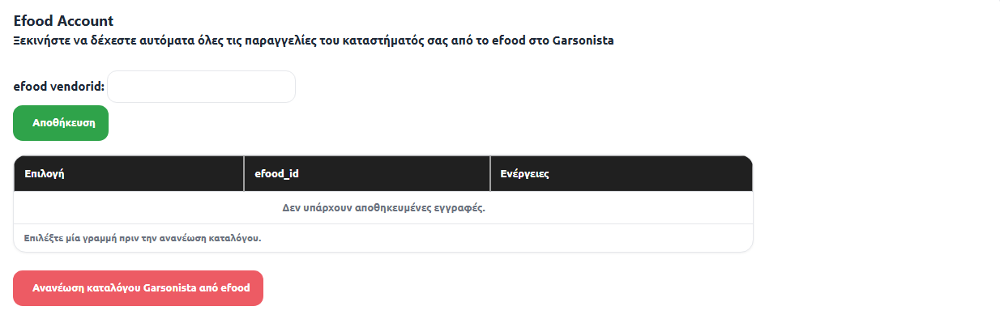
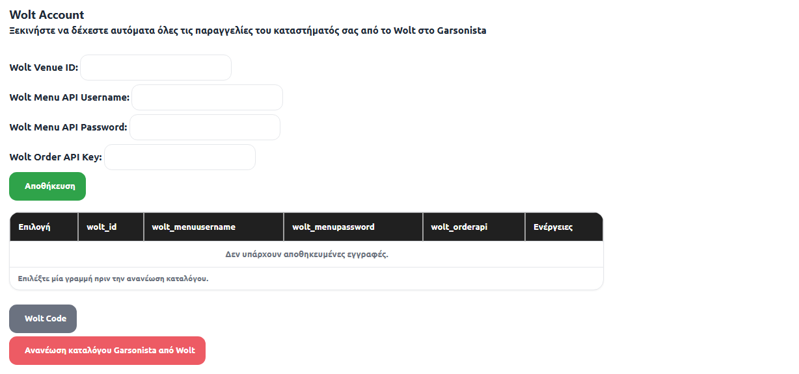
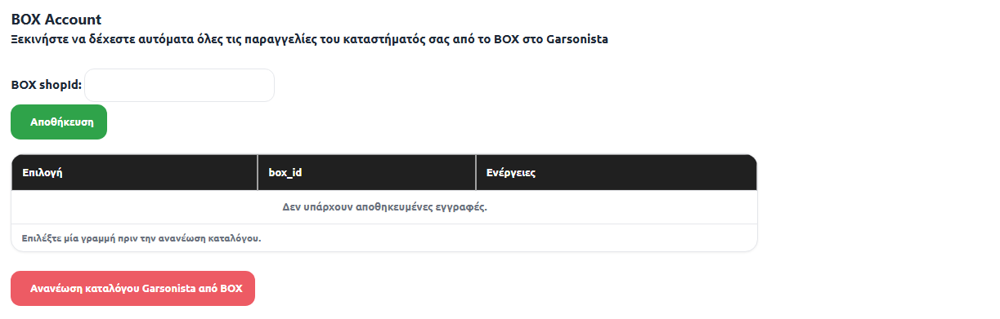

# Εγχειρίδιο — Διασύνδεση με efood / Wolt / Box

> Το Garsonista διασυνδέεται με τις πλατφόρμες παραγγελιοληψίας **efood**,
> **Wolt** και **Box**. Οι παραγγελίες από τις τρεις πλατφόρμες πέφτουν —
> αυτόματα ή με χειροκίνητη αποδοχή, ανάλογα με τη ρύθμιση — μέσα στο
> Garsonista, και το κατάστημα διαχειρίζεται στην πράξη **μία πλατφόρμα αντί
> για τρεις**: ένα σημείο για αποδοχή, ετοιμασία, εκτύπωση και έκδοση
> απόδειξης.

---

## 1. Πώς δουλεύει (σε μια ματιά)

- Η επιχείρηση κρατάει τους λογαριασμούς της στις πλατφόρμες όπως και πριν —
  το Garsonista «γεφυρώνεται» με αυτούς με τα κλειδιά (credentials) κάθε
  πλατφόρμας.
- Κάθε πλατφόρμα αποκτά το **δικό της τραπέζι** μέσα στο Garsonista· οι
  παραγγελίες της πέφτουν αυτόματα εκεί και τυπώνονται στα παραγγελιόχαρτα
  όπως όλες οι άλλες.
- Η πορεία της παραγγελίας (ΕΤΟΙΜΗ → ΠΑΡΑΔΟΘΗΚΕ) και η **αυτόματη έκδοση της
  τελικής απόδειξης** γίνονται μέσα από τη σελίδα παραγγελιών delivery του
  Garsonista.
- Για **κάθε** πλατφόρμα με ενεργή διασύνδεση εμφανίζεται στο **Διαχειριστικό →
  Αναφορές** η δική της **«Αναφορά παραγγελιών»** (πόσες παραγγελίες ήρθαν, πόσες
  έγιναν αποδεκτές / παραδόθηκαν / ακυρώθηκαν, αξία) — βλ. §7.6.

---

## 2. Ενεργοποίηση διασύνδεσης [ΤΕΧΝΙΚΟΣ]

> Το βήμα αυτό γίνεται **αποκλειστικά από την τεχνική ομάδα Garsonista, μέσα
> από το ComID (adminpanel)** — δεν είναι ενέργεια του καταστήματος.

1. Είσοδος στο **ComID**.
2. Στην καρτέλα του πελάτη υπάρχουν, σε μορφή checkbox — όπως και οι
   υπόλοιπες ρυθμίσεις — οι τρεις επιλογές: **«efood»**, **«Wolt»**, **«Box»**.
3. Με το check σε οποιαδήποτε από τις τρεις, εμφανίζονται από κάτω οι
   υποεπιλογές της:
   - efood: checkbox **«efood να γίνεται αποδοχή παραγγελιών από εμάς»**
   - Wolt: checkbox **«Wolt να γίνεται αποδοχή παραγγελιών από εμάς»**
   - Box: **δεν** υπάρχει αντίστοιχη επιλογή αποδοχής (βλ. παρακάτω γιατί)
   - Και στις τρεις εμφανίζεται επιπλέον το checkbox **«ΟΧΙ άμεσος κατάλογος»**
4. Προεπιλογές (defaults) με το check μιας πλατφόρμας:
   - **«ΟΧΙ άμεσος κατάλογος» → ΕΝΕΡΓΟ** εξ ορισμού
   - **«…να γίνεται αποδοχή παραγγελιών από εμάς» → ΑΝΕΝΕΡΓΟ** εξ ορισμού
5. Με το check μιας πλατφόρμας ο πελάτης βλέπει **αυτόματα** και την
   **«Αναφορά παραγγελιών»** της πλατφόρμας στο Διαχειριστικό → Αναφορές (§7.6),
   καθώς και το φίλτρο **«Ακυρωμένες»** στη σελίδα των παραγγελιών (§7.5).

### Τι σημαίνουν οι δύο επιλογές

**«…να γίνεται αποδοχή παραγγελιών από εμάς»** — καθορίζει από πού γίνεται η
αποδοχή της παραγγελίας:

- **Ανενεργό (default)**: η αποδοχή/απόρριψη γίνεται στη **συσκευή της
  πλατφόρμας** (efood/Wolt), και μόνο αφού γίνει αποδοχή εκεί η παραγγελία
  περνάει στο Garsonista. Έτσι δουλεύει το ~90% των πελατών.
- **Ενεργό**: η αποδοχή/απόρριψη γίνεται **μέσα από το Garsonista** (βλ. §7.4).
- **Box**: η αποδοχή γίνεται **πάντα** μέσα από την πλατφόρμα Box — γι' αυτό
  δεν υπάρχει η επιλογή για το Box.

**«ΟΧΙ άμεσος κατάλογος»** — κατά τη «γέφυρα» με μια πλατφόρμα υπάρχει η
δυνατότητα να περαστεί αυτόματα **ολόκληρος ο κατάλογος** προϊόντων της
πλατφόρμας στο Garsonista (περιγραφές, τιμές, φωτογραφίες, τροποποιητές).
Οι περισσότερες επιχειρήσεις όμως περνούν τον κατάλογό τους ξεχωριστά, γι'
αυτό η επιλογή είναι **ενεργή εξ ορισμού**: αυτόματη εισαγωγή καταλόγου
γίνεται **μόνο αν αφαιρεθεί** το check.

### Συγκεντρωτικός πίνακας προεπιλογών

| Πλατφόρμα | «Αποδοχή παραγγελιών από εμάς» | «ΟΧΙ άμεσος κατάλογος» |
|---|---|---|
| efood | Διαθέσιμο — default: **ΑΝΕΝΕΡΓΟ** | Διαθέσιμο — default: **ΕΝΕΡΓΟ** |
| Wolt | Διαθέσιμο — default: **ΑΝΕΝΕΡΓΟ** | Διαθέσιμο — default: **ΕΝΕΡΓΟ** |
| Box | **Μη διαθέσιμη επιλογή** | Διαθέσιμο — default: **ΕΝΕΡΓΟ** |

---

## 3. Σετάρισμα από τον χρήστη — κλειδιά πλατφορμών

Μόλις η τεχνική ομάδα ενεργοποιήσει τις πλατφόρμες, στο **Διαχειριστικό
(web)** του χρήστη εμφανίζονται — κάτω στις ρυθμίσεις, στο ίδιο σημείο με τις
ρυθμίσεις QR — οι επιλογές **«Efood»**, **«Wolt»** και **«Box»**. Το πρώτο
βήμα σε κάθε μία είναι να περαστούν τα **κλειδιά (credentials)** της
αντίστοιχης πλατφόρμας, ώστε να συνδεθεί ο λογαριασμός του καταστήματος με το
Garsonista.

### 3.1 Efood Account

Απαιτούμενο πεδίο: **«efood vendorid»**.

1. Συμπληρώνουμε το «efood vendorid» και πατάμε **«Αποθήκευση»** — η εγγραφή
   εμφανίζεται στον πίνακα από κάτω.
2. Επιλέγουμε τη γραμμή του πίνακα και πατάμε **«Ανανέωση καταλόγου
   Garsonista από efood»** για να συγχρονιστεί ο κατάλογος.

> Το efood vendorid **δεν** είναι διαθέσιμο άμεσα στον χρήστη: ζητείται **με
> email από το efood** και η απάντηση έρχεται συνήθως εντός μίας εργάσιμης
> ημέρας.

**Τροποποιητές που εξαρτώνται από άλλη επιλογή:** με άμεσο κατάλογο (όχι «ΟΧΙ
άμεσος κατάλογος»), η «Ανανέωση καταλόγου Garsonista από efood» φέρνει και:

- τις ομάδες που στο efood εμφανίζονται **μόνο μετά από μια επιλογή** (π.χ.
  «Επιλέξτε υλικά» → «Υλικά»): στο Garsonista η ομάδα δεν είναι ανοιχτή από την
  αρχή και ανοίγει όταν επιλεγεί η αντίστοιχη επιλογή·
- τις **διαφορετικές τιμές** μιας επιλογής ανάλογα με άλλη επιλογή (π.χ. έξτρα
  τυρί 0,50 € στο μικρό, 1,00 € στο μεγάλο) και επιλογές που δεν διατίθενται σε
  κάποιο συνδυασμό. Αυτά ισχύουν στον κατάλογο που ξαναστέλνεται στο efood.

Με κάθε νέα ανανέωση αυτά ξαναγράφονται όπως είναι στο efood.

**Φωτογραφίες από το efood [ΤΕΧΝΙΚΟΣ]:** η «Ανανέωση καταλόγου» κρατά μόνο το
link της φωτογραφίας κάθε είδους του efood — **δεν** αλλάζει φωτογραφίες. Για
να κατέβουν:

1. Πρώτα **«Ανανέωση καταλόγου Garsonista από efood»**.
2. Μετά **«Λήψη εικόνων από efood»** και συμπληρώνουμε τον **κωδικό** που
   ζητάει (τον δίνει η τεχνική ομάδα).
3. Κατεβαίνουν φωτογραφίες **μόνο** σε είδη (και κατηγορίες) που **δεν** έχουν
   ήδη δική τους. Με «ΟΧΙ άμεσος κατάλογος», μόνο σε είδη που είναι
   αντιστοιχισμένα στο **«efood αντίστοιχο προϊόν»** (§4).
4. Στο τέλος εμφανίζεται πόσες κατέβηκαν και πόσες απέτυχαν. Μπορεί να
   ξαναπατηθεί με ασφάλεια — όσα έχουν ήδη φωτογραφία παραλείπονται.

**Διαγραφή καταλόγου efood [ΤΕΧΝΙΚΟΣ]:** το κουμπί **«Διαγραφή καταλόγου
efood»** σβήνει **στο efood** (όχι στο Garsonista) **ολόκληρο** τον κατάλογο
του καταστήματος: είδη, ομάδες τροποποιητών, επιλογές και κατηγορίες, και όσα
είχαν δημιουργηθεί μέσα στο efood. Χρησιμεύει όταν ο κατάλογος στο efood
πρέπει να ξανασταλεί από την αρχή (§8). Η ενέργεια είναι **μη αναστρέψιμη**,
γι' αυτό γίνεται σε βήματα:

1. Επιλέγουμε τη γραμμή του λογαριασμού στον πίνακα (αν υπάρχει μόνο μία,
   επιλέγεται μόνη της) και πατάμε **«Διαγραφή καταλόγου efood»**.
2. Συμπληρώνουμε τον **κωδικό** που ζητάει (τον δίνει η τεχνική ομάδα, ο ίδιος
   με τη «Λήψη εικόνων από efood»).
3. Εμφανίζεται **τι υπάρχει στο efood** (κατηγορίες, είδη, ομάδες, επιλογές)
   και **τι θα διαγραφεί**. Αν κάτι δεν έχει κανένα κλειδί διαγραφής, που
   κανονικά δεν συμβαίνει, εμφανίζεται ονομαστικά ως «δεν διαγράφεται από εδώ».
4. Πατάμε **«Διαγραφή»** για να εκτελεστεί. Μέχρι τότε δεν έχει αλλάξει τίποτα.
5. Η διαγραφή **τρέχει στον server** και εμφανίζεται κάρτα **«Διαγραφή
   καταλόγου efood σε εξέλιξη»** με μπάρα προόδου και το βήμα που εκτελείται
   (διαγραφή ειδών → αναμονή να την εφαρμόσει το efood → διαγραφή κατηγοριών →
   αναμονή). Το efood εφαρμόζει τη διαγραφή με καθυστέρηση λίγων δευτερολέπτων,
   γι' αυτό υπάρχουν τα βήματα αναμονής. Αν κλείσουμε τη σελίδα, η διαγραφή
   **συνεχίζει κανονικά** και η μπάρα ξαναεμφανίζεται μόλις ανοίξουμε ξανά τις
   Ρυθμίσεις efood. Όσο τρέχει, δεν μπορεί να ξεκινήσει δεύτερη.
6. Στο τέλος εμφανίζεται **τι έμεινε στο efood** μετά τη διαγραφή και η
   απάντηση του efood σε κάθε βήμα, ώστε να φαίνεται αν κάτι δεν έσβησε.

Τα είδη και οι ρυθμίσεις τους στο Garsonista **δεν** επηρεάζονται. Για να
ξανασταλούν στο efood ισχύουν όσα περιγράφονται στο §8 (ενημέρωση καταλόγου
από το Garsonista).

### 3.2 Wolt Account

Απαιτούμενα πεδία:

- **«Wolt Venue ID»**
- **«Wolt Menu API Username»**
- **«Wolt Menu API Password»**
- **«Wolt Order API Key»**

1. Συμπληρώνουμε τα τέσσερα πεδία και πατάμε **«Αποθήκευση»** — η εγγραφή
   εμφανίζεται στον πίνακα από κάτω.
2. Διαθέσιμα κουμπιά: **«Wolt Code»** και **«Ανανέωση καταλόγου Garsonista
   από Wolt»** για τον συγχρονισμό του καταλόγου.

> Τα στοιχεία του Wolt (Venue ID, Menu API Username/Password, Order API Key)
> ζητούνται **με email από το Wolt** — απάντηση συνήθως εντός μίας εργάσιμης
> ημέρας.

### 3.3 BOX Account

Απαιτούμενο πεδίο: **«BOX shopId»**.

1. Συμπληρώνουμε το «BOX shopId» και πατάμε **«Αποθήκευση»**.
2. Επιλέγουμε τη γραμμή και πατάμε **«Ανανέωση καταλόγου Garsonista από BOX»**.

> Σε αντίθεση με efood/Wolt, το BOX shopId λαμβάνεται **απευθείας από την
> εφαρμογή του BOX** — δεν χρειάζεται email και αναμονή.

**Τι φέρνει η «Ανανέωση καταλόγου Garsonista από BOX»:** κατηγορίες, είδη και
τροποποιητές (ομάδες και επιλογές) — **χωρίς τιμές**, γιατί ο κατάλογος του BOX
δεν τις περιέχει.

- Με **«ΟΧΙ άμεσος κατάλογος»** (§2): τα είδη του BOX μπαίνουν μόνο στη λίστα
  **«box αντίστοιχο προϊόν»** για αντιστοίχιση (§4) — ο κατάλογος του
  Garsonista δεν αλλάζει.
- Χωρίς αυτό: δημιουργούνται/ενημερώνονται κατηγορίες, είδη και τροποποιητές.
  Σε ό,τι **υπάρχει ήδη** αλλάζει μόνο το όνομα (και η κατηγορία του είδους)·
  τιμές, ΦΠΑ, διαθεσιμότητα και ρυθμίσεις τροποποιητών **δεν** αγγίζονται. Τα
  **νέα** είδη και επιλογές μπαίνουν με **τιμή 0** — συμπληρώστε τις τιμές στον
  κατάλογο. Οι νέες ομάδες τροποποιητών μπαίνουν ως «Πολλαπλές επιλογές»,
  προαιρετικές· αλλάξτε τες στη σελίδα **«Τροποποιητές»** όπου χρειάζεται.
- Οι **προσφορές** του BOX δεν εισάγονται ακόμα.

---

## 4. Αντιστοίχιση ειδών με efood / Wolt / Box

> Για το Box η λίστα **«box αντίστοιχο προϊόν»** γεμίζει από την «Ανανέωση
> καταλόγου Garsonista από BOX» με ενεργό το «ΟΧΙ άμεσος κατάλογος» (§3.3).
> Χωρίς αυτό, τα είδη που φέρνει η ανανέωση είναι ήδη αντιστοιχισμένα.

Για να «κουμπώνει» κάθε είδος του καταλόγου με το αντίστοιχο προϊόν της
πλατφόρμας:

1. **Διαχειριστικό → Κατάλογος Προϊόντων**.
2. **Επεξεργασία** σε κάθε είδος που υπάρχει και στο efood και στο Wolt.
3. Scroll στις **«Περισσότερες ρυθμίσεις» → «Πλατφόρμες delivery»** (μία κάρτα ανά πλατφόρμα).
4. Συμπληρώνουμε τον κωδικό του είδους στα πεδία **«efood αντίστοιχο
   προϊόν»**, **«Wolt αντίστοιχο προϊόν»** και **«box αντίστοιχο προϊόν»**.

**Τι γίνεται χωρίς αντιστοίχιση**: όταν έρθει παραγγελία με μη αντιστοιχισμένο
είδος, το Garsonista δημιουργεί **αυτόματα νέο προϊόν** με το όνομα όπως ήρθε
από την πλατφόρμα, μέσα σε νέα κατηγορία **«Efood Extra»** — η ίδια κατηγορία
χρησιμοποιείται και για το efood και για το Wolt, και εκεί καταλήγουν όλα τα
μη αντιστοιχισμένα είδη. Σε κάποιες επιχειρήσεις αυτό δεν ενοχλεί, αλλά
**προτείνεται η χειροκίνητη αντιστοίχιση** για να μένει ο κατάλογος
οργανωμένος.

---

## 5. Δημιουργία τραπεζιών ανά πλατφόρμα

Αφού περαστούν τα κλειδιά, δημιουργούμε **ένα ξεχωριστό τραπέζι για κάθε
πλατφόρμα** από το **Διαχειριστικό → Τραπέζια**:

1. Νέο τραπέζι για κάθε πλατφόρμα (efood, Wolt, Box).
2. Το τοποθετούμε στον χώρο που θέλει η επιχείρηση — μπορεί να δημιουργηθεί
   και νέος χώρος με όνομα π.χ. «Πλατφόρμες», αποκλειστικά για αυτά τα
   τραπέζια.
3. Το ονομάζουμε με το όνομα της πλατφόρμας, π.χ. «Efood».
4. Ορίζουμε τη **θέση εμφάνισης** (πόσο ψηλά/χαμηλά στη λίστα).
5. Scroll πιο κάτω στη φόρμα του τραπεζιού και τσεκάρουμε:
   - **«Πάντα τελική έκδοση Αποδ.Λιανικής αντί για Δ.Παραγγελίας»**
   - **«Παίρνει παραγγελίες Delivery»**
   - **«Είναι τραπέζι efood»** — μόνο για το τραπέζι efood
   - **«Είναι τραπέζι Wolt»** — μόνο για το τραπέζι Wolt
   - **«Είναι τραπέζι Box»** — μόνο για το τραπέζι Box
6. **«Αποθήκευση»**.

---

## 6. Ρύθμιση χρήστη POS

Το τελευταίο βήμα του σεταρίσματος, στο **Διαχειριστικό → Χρήστες**:

1. Επιλέγουμε τον χρήστη που δουλεύει το web περιβάλλον — συνήθως τον χρήστη
   **POS**.
2. Στην ενότητα **«Λοιπά»** ενεργοποιούμε την επιλογή **«Αποδοχή παραγγελιών
   Delivery»**.

---

## 7. Τρόπος λειτουργίας στην πράξη

> Η περιγραφή αφορά το πιο συνηθισμένο σενάριο: **«…να γίνεται αποδοχή
> παραγγελιών από εμάς» ανενεργό** (default — §2). Ο χρήστης βρίσκεται
> κανονικά μέσα στο πρόγραμμα, στην Παραγγελιοληψία ή στο module Take Away.

### 7.1 Ειδοποίηση νέας παραγγελίας

- Με ενεργή την «Αποδοχή παραγγελιών Delivery» στον χρήστη POS (§6),
  εμφανίζεται ένα **μικρό κυκλικό εικονίδιο πάνω αριστερά** στην οθόνη.
- Κάθε φορά που έρχεται νέα παραγγελία από πλατφόρμα (και γίνει αποδοχή της
  στη συσκευή της πλατφόρμας), το εικονίδιο **αναβοσβήνει**.
- Πατώντας το, ο χρήστης μεταφέρεται στη **σελίδα με όλες τις παραγγελίες
  delivery** του καταστήματος, όπου φαίνεται:
  - αν η παραγγελία είναι **πληρωμένη** ή όχι,
  - **για πού** είναι η παραγγελία,
  - από **ποια πλατφόρμα** προέρχεται — efood, Wolt ή Box.

### 7.2 Τραπέζι και εκτύπωση

Οι παραγγελίες πέφτουν αυτόματα και στο **αντίστοιχο τραπέζι της πλατφόρμας**
(§5). Αν το κατάστημα έχει εκτυπωτάκι, τα **παραγγελιόχαρτα τυπώνονται
κανονικά** στους αντίστοιχους εκτυπωτές.

### 7.3 Έκδοση απόδειξης

Από τη σελίδα των παραγγελιών delivery:

1. Πατάμε πρώτα **«ΕΤΟΙΜΗ»**.
2. Μετά πατάμε **«ΠΑΡΑΔΟΘΗΚΕ»** — με το «ΠΑΡΑΔΟΘΗΚΕ» εκδίδεται **αυτόματα η
   τελική απόδειξη λιανικής**, με τον αντίστοιχο τρόπο πληρωμής.

### 7.4 Αποδοχή παραγγελίας μέσα από το Garsonista (efood / Wolt)

> Ισχύει μόνο για efood/Wolt, όταν είναι ενεργή η επιλογή **«…να γίνεται
> αποδοχή παραγγελιών από εμάς»** (§2). Για το Box η αποδοχή γίνεται πάντα
> στην πλατφόρμα Box.

1. Το αίτημα έρχεται πάλι από το **κυκλάκι πάνω αριστερά** — αυτή τη φορά
   συνοδεύεται και **από ήχο**.
2. Στη σελίδα των παραγγελιών, **στο πάνω μέρος** εμφανίζεται η παραγγελία
   που περιμένει αποδοχή ή απόρριψη.
3. **«Αποδοχή»** → η παραγγελία πέφτει κανονικά στις παραγγελίες και στο
   αντίστοιχο τραπέζι.
4. **«Απόρριψη»** → ζητείται ο **λόγος της απόρριψης** και η παραγγελία
   εξαφανίζεται.
5. Αν η παραγγελία έχει στο μεταξύ **λήξει ή ακυρωθεί στην πλατφόρμα** (π.χ.
   δεν προλάβαμε να απαντήσουμε εγκαίρως), τότε είτε πατήσουμε **«Αποδοχή»**
   είτε **«Απόρριψη»** εμφανίζεται το μήνυμα **«Η παραγγελία είχε ήδη λήξει ή
   ακυρωθεί στην πλατφόρμα και αφαιρέθηκε από τη λίστα»** και η παραγγελία
   φεύγει από τη λίστα αποδοχής.
6. **Wolt:** όταν η ακύρωση γίνει από την πλευρά του Wolt (πελάτης, υποστήριξη
   ή λήξη του χρόνου αποδοχής), η παραγγελία **φεύγει μόνη της** από τη λίστα
   αποδοχής μόλις το Wolt μας ενημερώσει, χωρίς καμία ενέργεια. Αν η ακύρωση
   έρθει **μετά** την αποδοχή, η παραγγελία ακυρώνεται αυτόματα μόνο εφόσον δεν
   έχει εκδοθεί παραστατικό· διαφορετικά μένει, με την ένδειξη **«ΑΚΥΡΩΘΗΚΕ ΑΠΟ
   WOLT»** στα σχόλιά της, και το ακυρωτικό εκδίδεται από τον χρήστη.
7. **efood — ακύρωση:** το ίδιο ισχύει και για το efood. Όταν η παραγγελία
   ακυρωθεί από την πλευρά του efood (πελάτης, κατάστημα ή λήξη του χρόνου
   αποδοχής), φεύγει μόνη της από τη λίστα αποδοχής, χωρίς καμία ενέργεια.
   Αν η ακύρωση έρθει **μετά** την αποδοχή και έχει ήδη εκδοθεί
   παραστατικό, η παραγγελία μένει με την ένδειξη **«ΑΚΥΡΩΘΗΚΕ ΑΠΟ EFOOD»** στα
   σχόλιά της.
8. **efood — αποδοχή από το tablet/portal του efood:** αν το κατάστημα έχει ήδη
   αποδεχτεί την παραγγελία στο efood και πατήσετε **«Αποδοχή»** στο Garsonista,
   εμφανίζεται το μήνυμα **«Η παραγγελία είχε ήδη γίνει αποδεκτή στο efood και
   μεταφέρθηκε στις παραγγελίες»** και η παραγγελία περνά κανονικά στις
   παραγγελίες. Αν πατήσετε **«Απόρριψη»**, η παραγγελία **δεν** απορρίπτεται:
   εμφανίζεται μήνυμα ότι έχει ήδη γίνει αποδεκτή στο efood και περνά στις
   παραγγελίες. Το efood δεν ειδοποιεί το Garsonista για την αποδοχή από το
   tablet του, γι' αυτό η παραγγελία μένει στη λίστα αποδοχής μέχρι να πατηθεί
   ένα από τα δύο κουμπιά.
9. **Wolt — η παραγγελία είχε ήδη γίνει αποδεκτή:** αν η παραγγελία έχει ήδη
   γίνει αποδεκτή στο Wolt (π.χ. η αποδοχή πέρασε στο Wolt αλλά η απάντησή του
   δεν έφτασε στο Garsonista), το Garsonista ελέγχει την κατάσταση της
   παραγγελίας στο Wolt και ακολουθεί αυτή:
   - με **«Αποδοχή»** εμφανίζεται **«Η παραγγελία είχε ήδη γίνει αποδεκτή στη
     Wolt και μεταφέρθηκε στις παραγγελίες»** και η παραγγελία περνά κανονικά
     στις παραγγελίες·
   - με **«Απόρριψη»** η παραγγελία **δεν** απορρίπτεται (το Wolt δεν το
     επιτρέπει πλέον): εμφανίζεται μήνυμα ότι έχει ήδη γίνει αποδεκτή στη Wolt
     και περνά στις παραγγελίες.
10. **Όταν η πλατφόρμα δεν απαντά ή αρνείται την ενέργεια** (efood / Wolt), η
    παραγγελία **μένει όπως ήταν** στη λίστα αποδοχής και εμφανίζεται μήνυμα στα
    ελληνικά:
    - **«Η πλατφόρμα … δεν απάντησε. Η παραγγελία δεν άλλαξε κατάσταση —
      δοκιμάστε ξανά σε λίγο.»** → πατήστε ξανά το ίδιο κουμπί σε λίγο. Αν στο
      μεταξύ η παραγγελία έγινε αποδεκτή ή ακυρώθηκε στην πλατφόρμα, το
      Garsonista θα την περάσει αυτόματα στη σωστή κατάσταση (σημεία 5, 8, 9).
    - **«Δεν ήταν δυνατή η επικοινωνία με την πλατφόρμα …»** → ελέγξτε την
      παραγγελία στην εφαρμογή/tablet της πλατφόρμας και δοκιμάστε ξανά.
    - **«Η πλατφόρμα … δεν δέχτηκε την ενέργεια…»** → από κάτω φαίνεται με
      μικρά γράμματα η **«Απάντηση πλατφόρμας»** (στα αγγλικά), χρήσιμη για την
      υποστήριξη.
    - **«Αποτυχία σύνδεσης με την πλατφόρμα …»** → λείπουν ή είναι λάθος τα
      στοιχεία σύνδεσης του καταστήματος (§3).

### 7.5 Ακυρωμένες παραγγελίες

Στη σελίδα των παραγγελιών, στη σειρά **«Κατάσταση»**, το κουμπί
**«Ακυρωμένες»** δείχνει τις παραγγελίες efood / Wolt / Box που **δεν**
ολοκληρώθηκαν:

- ακυρώθηκαν από την πλατφόρμα (από τον πελάτη, την υποστήριξη ή επειδή
  έληξε ο χρόνος αποδοχής),
- απορρίφθηκαν από το κατάστημα με **«Απόρριψη»**.

Εμφανίζονται με την ένδειξη **«ΑΚΥΡΩΘΗΚΕ»**, μόνο όταν είναι πατημένο το
«Ακυρωμένες» — στις «Αποδεκτές» και στα υπόλοιπα φίλτρα δεν φαίνονται. Με
κλικ στην παραγγελία φαίνονται η **ώρα** και η **αιτία ακύρωσης** (π.χ.
«Ακυρώθηκε από τη Wolt», «Έληξε ή ακυρώθηκε στην πλατφόρμα πριν την αποδοχή» ή
η αιτία που επιλέχθηκε στην «Απόρριψη»). Δεν υπάρχει καμία ενέργεια πάνω σε
ακυρωμένη παραγγελία και δεν μετράει στην **«Εξαγωγή σε Excel»**.

Το κουμπί εμφανίζεται μόνο σε καταστήματα με διασύνδεση σε τουλάχιστον μία
πλατφόρμα και συνδυάζεται με το φίλτρο **«Πηγή»** (π.χ. «Ακυρωμένες» + «Wolt»
= μόνο οι ακυρωμένες της Wolt) και με το φίλτρο ημερομηνιών.

### 7.6 Αναφορά παραγγελιών ανά πλατφόρμα

Στο **Διαχειριστικό → Αναφορές** εμφανίζεται μία επιπλέον κάρτα
**«Αναφορά παραγγελιών efood / Wolt / Box»** για **κάθε** πλατφόρμα με την οποία
έχει διασύνδεση το κατάστημα (π.χ. κατάστημα με Wolt και Box βλέπει δύο κάρτες).
Η κάρτα εμφανίζεται **αυτόματα** μόλις ενεργοποιηθεί η διασύνδεση με την
πλατφόρμα (§2) — δεν χρειάζεται καμία άλλη ρύθμιση. Χωρίς διασύνδεση η κάρτα δεν
εμφανίζεται.

Η αναφορά δείχνει, για την περίοδο που επιλέγεται (**Από / Έως ημερομηνία** —
προεπιλογή ο τρέχων μήνας):

- **Παραγγελίες**: όσες ήρθαν από την πλατφόρμα.
- **Αποδεκτές** και, από αυτές, πόσες **Παραδόθηκαν**.
- **Σε αναμονή αποδοχής**: όσες δεν έχουν ακόμη απάντηση.
- **Ακυρωμένες**, χωρισμένες σε **Ακύρωση από την πλατφόρμα** (πελάτης,
  υποστήριξη, λήξη χρόνου αποδοχής) και **Απόρριψη από το κατάστημα**.
- **Αξία αποδεκτών** και **Μέση αξία** παραγγελίας.
- **Τρόπος πληρωμής**: πόσα από τα ποσά των αποδεκτών παραγγελιών πληρώθηκαν με
  **Μετρητά**, **Κάρτες** ή **Τράπεζα**, όπως γράφτηκε στην απόδειξη κάθε παραγγελίας.
  Μετρούν μόνο παραγγελίες για τις οποίες έχει ήδη εκδοθεί απόδειξη, οπότε το
  άθροισμά τους μπορεί να είναι μικρότερο από την «Αξία αποδεκτών». Παραγγελία
  που πληρώθηκε online στην πλατφόρμα εμφανίζεται στην **Τράπεζα**.

Κάτω από τα σύνολα εμφανίζεται ένας πίνακας. Με τα κουμπιά **«Ανά ημέρα»** /
**«Ανά είδος»**, δίπλα στην **«Αναζήτηση»**, επιλέγετε ποιον θέλετε να δείτε —
εμφανίζεται ένας κάθε φορά, με προεπιλογή το «Ανά ημέρα»:

- **Ανά ημέρα**: τα ίδια σύνολα για κάθε ημέρα της περιόδου.
- **Ανά είδος**: η **Ποσότητα** και η **Αξία** κάθε είδους που πουλήθηκε μέσω
  της πλατφόρμας στην περίοδο, με πρώτα τα είδη με τη μεγαλύτερη αξία. Μετρούν
  μόνο οι **αποδεκτές** παραγγελίες — όχι όσες είναι σε αναμονή αποδοχής ή
  ακυρωμένες.

Η αναφορά δείχνει **πόσες** ακυρώσεις έγιναν και από ποιον — όχι την αιτία της
κάθε ακύρωσης. Την αιτία μιας συγκεκριμένης παραγγελίας τη βλέπετε στη σελίδα
των παραγγελιών, με το φίλτρο **«Ακυρωμένες»** (§7.5).

Η πρόσβαση ακολουθεί το δικαίωμα **«Αναφορές»** του χρήστη.

### 7.7 Πώς εξαιρώ είδη που τιμολογούνται από άλλο σύστημα

Χρήσιμο όταν η ίδια παραγγελία πλατφόρμας περιέχει είδη που **δεν** τα
τιμολογεί το Garsonista (π.χ. είδη ενός δεύτερου καταστήματος που εκδίδει τις
αποδείξεις του από άλλο πρόγραμμα). Τα είδη αυτά υπάρχουν στο Garsonista μόνο
για να γίνεται η αντιστοίχιση με την πλατφόρμα (§4).

1. Πηγαίνουμε **Διαχειριστικό → Κατηγορίες προϊόντων** και ανοίγουμε την
   κατηγορία των ειδών αυτών.
2. Στην ενότητα **«Περισσότερα»**, κάτω από το «Ωράριο διαθεσιμότητας»,
   τσεκάρουμε **«Τιμολόγηση εκτός Garsonista»**.
3. Πατάμε **«Αποθήκευση»**.

Από εκεί και πέρα, για κάθε **νέα** παραγγελία efood / Wolt / Box, τα είδη που
έχουν αυτή την κατηγορία ως **κύρια κατηγορία**:

- **δεν μπαίνουν στην απόδειξη** που εκδίδεται με το «ΠΑΡΑΔΟΘΗΚΕ» (§7.3) — η
  απόδειξη και το ποσό της αφορούν μόνο τα υπόλοιπα είδη,
- **δεν τυπώνονται στο παραγγελιόχαρτο** και **δεν εμφανίζονται στο KDS**,
- **δεν κρατούν ανοιχτό το τραπέζι** της πλατφόρμας,
- **δεν μετράνε** στα στατιστικά τζίρου ανά τραπέζι / σερβιτόρο.

Στη σελίδα των παραγγελιών delivery η παραγγελία εμφανίζεται **ολόκληρη**, με
όλα τα είδη της, ώστε το προσωπικό να ξέρει τι να ετοιμάσει. Αν μια παραγγελία
έχει **μόνο** τέτοια είδη, το Garsonista δεν εκδίδει καμία απόδειξη γι' αυτήν.

> Η απόδειξη για τα είδη αυτά πρέπει να εκδοθεί από το άλλο σύστημα — το
> Garsonista δεν την εκδίδει και δεν την παρακολουθεί.

---

## 8. Αυτόματη ενημέρωση καταλόγου efood / Wolt από το Garsonista

> Με αυτή τη λειτουργία το **Garsonista γίνεται η πηγή του καταλόγου**: όταν
> αλλάζει ένα είδος στο Garsonista (τιμή, διαθεσιμότητα, απόθεμα, όνομα,
> τροποποιητές), η αλλαγή στέλνεται **αυτόματα** στο efood μέσα σε λίγα λεπτά.
> Δεν χρειάζεται πια να γίνεται η ίδια αλλαγή και στο efood.
>
> Προς το παρόν διαθέσιμη **μόνο για το efood**. Για Wolt και Box τα πεδία
> υπάρχουν ήδη, αλλά η αυτόματη ενημέρωση δεν έχει ενεργοποιηθεί ακόμα.

### 8.1 Ενεργοποίηση για το κατάστημα [ΤΕΧΝΙΚΟΣ]

1. Είσοδος στο **ComID**, καρτέλα του πελάτη, ενότητα «Διασύνδεση με πλατφόρμες».
2. Κάτω από το **«Διασύνδεση με efood»** ενεργοποιούμε την υποεπιλογή
   **«Ενημέρωση καταλόγου efood από το Garsonista»**.
3. Προεπιλογή: **ανενεργή**. Χωρίς αυτήν, κανένα είδος του καταστήματος δεν
   στέλνεται, ό,τι κι αν έχει οριστεί στα είδη.
4. Είναι **ανεξάρτητη** από το «ΟΧΙ άμεσος κατάλογος»: εκείνο αφορά μόνο τη
   λήψη καταλόγου **από** το efood, όχι την αποστολή **προς** το efood.

> **Προσοχή — κατάστημα που έχει ήδη κατάλογο στο efood.** Αν ο κατάλογος του
> καταστήματος στο efood φτιάχτηκε από το ίδιο το efood, **μην** ενεργοποιηθεί
> η ενημέρωση χωρίς προηγούμενη μετάβαση από την τεχνική ομάδα. Το efood δεν
> αναγνωρίζει αυτά τα είδη ως ίδια με του Garsonista, και η πρώτη αποστολή θα
> δημιουργήσει **διπλά είδη** στο efood (βλ. §8.6). Για νέο κατάστημα, με άδειο
> κατάλογο στο efood, η ενημέρωση ενεργοποιείται αμέσως.

### 8.2 Επιλογή ειδών

Η ενημέρωση γίνεται **ανά είδος**, ώστε να μπορούμε να κρατήσουμε κάποια είδη
εκτός efood.

1. **Διαχειριστικό → Κατάλογος Προϊόντων → Επεξεργασία** του είδους.
2. **«Περισσότερες ρυθμίσεις» → «Πλατφόρμες delivery»**.
3. Στην κάρτα **efood** ενεργοποιούμε το **«Ενημέρωση»** και πατάμε **«Αποθήκευση»**.

Στην ίδια ενότητα, για κάθε πλατφόρμα, υπάρχουν και:

| Πεδίο | Τι δείχνει |
|---|---|
| **«Αριθμός προσπάθειας ενημέρωσης»** | `0` = τίποτα σε αναμονή. `1` = το είδος θα σταλεί στην επόμενη ενημέρωση. Μεγαλύτερος αριθμός = η αποστολή αποτυγχάνει και ξαναδοκιμάζεται (§8.5). Μπορεί να αλλάξει χειροκίνητα: `1` για να ξαναπροσπαθήσει. |
| **«SKU στην πλατφόρμα»** | Ο κωδικός με τον οποίο το efood γνωρίζει το είδος. Συμπληρώνεται αυτόματα μετά την πρώτη επιτυχή αποστολή· **δεν** αλλάζει από τον χρήστη. |

### 8.3 Τι στέλνεται στο efood

- **Όνομα** και **περιγραφή** του είδους.
- **Τιμή**: η **«τιμή delivery»** του είδους. Αν έχει οριστεί **τιμή για το
  είδος στο τραπέζι efood** (τιμές ανά τραπέζι), στέλνεται εκείνη — έτσι η
  παραγγελιοληψία στο τραπέζι efood και το efood δείχνουν την ίδια τιμή.
  Η **«τιμή καταστήματος» δεν στέλνεται**.
- **Διαθεσιμότητα**: μη διαθέσιμο είδος, ή είδος με «Παρακολούθηση υπολοίπου»
  και υπόλοιπο 0, εμφανίζεται στο efood ως **μη διαθέσιμο**. Ανενεργό είδος, ή
  είδος σημειωμένο «ανενεργό» στο τραπέζι efood, **κρύβεται** από το efood.
- **Κατηγορία** του είδους (δημιουργείται στο efood αν δεν υπάρχει).
- **Τροποποιητές** με τις τιμές τους για το συγκεκριμένο είδος. Οι ομάδες που
  είναι σημειωμένες **«Είναι προθέματα τροποποιητών»** (π.χ. «ΜΕ», «ΧΩΡΙΣ»,
  «ΠΟΛΥ») **δεν** στέλνονται ποτέ: στο efood θα εμφανίζονταν ως ανεξάρτητες
  επιλογές χωρίς νόημα για τον πελάτη. Επίσης **δεν** στέλνονται οι ομάδες
  στις οποίες είναι απενεργοποιημένο το **«Προβολή σε QR menu, KDS, Delivery
  Platforms»** (σελίδα «Τροποποιητές» → επεξεργασία ομάδας → «Προχωρημένα
  (ομάδας)»).
- **Ομάδες μίας επιλογής με «Καθορίζει αρχική τιμή delivery»**: στο Garsonista
  η τιμή της επιλογής **αντικαθιστά** την τιμή του είδους, ενώ το efood πάντα
  **προσθέτει** την τιμή της επιλογής στην τιμή του είδους. Γι' αυτό στο efood
  το είδος εμφανίζεται με τιμή **τη φθηνότερη επιλογή** της ομάδας, και οι
  υπόλοιπες επιλογές με τη **διαφορά** τους από αυτήν. Παράδειγμα: είδος με
  επιλογές «Τεμάχιο» 8,50 € και «Μενού» 10,00 € → στο efood το είδος δείχνει
  8,50 €, «Τεμάχιο» χωρίς επιπλέον χρέωση και «Μενού» +1,50 €. Ο πελάτης
  πληρώνει 8,50 € ή 10,00 €, όσο ακριβώς και στο κατάστημα.
- **Ομάδες που εμφανίζονται μόνο μετά από επιλογή**: αν μια επιλογή
  **ενεργοποιεί** άλλη ομάδα (π.χ. στην ομάδα «Επιλογή» η επιλογή «Επιλέξτε
  υλικά» ανοίγει την ομάδα «Υλικά») και η ομάδα αυτή **δεν** είναι ενεργή από
  προεπιλογή, τότε και στο efood οι επιλογές της εμφανίζονται **μόνο** όταν ο
  πελάτης διαλέξει την επιλογή που την ενεργοποιεί — όπως στο κατάστημα.
- **Εξαρτήσεις τιμής** (π.χ. «με Μεγάλο μέγεθος το Μπέικον κοστίζει 1,50 €, με
  Μικρό δεν διατίθεται»): στέλνονται στο efood με την ίδια τιμή/διαθεσιμότητα.
  Το efood επιτρέπει σε κάθε ομάδα να εξαρτάται από **μία** μόνο άλλη ομάδα· αν
  μια ομάδα εξαρτάται από περισσότερες, στέλνεται η εξάρτηση από εκείνη που την
  ενεργοποιεί (αλλιώς από εκείνη με τις περισσότερες εξαρτήσεις).
- **Φωτογραφία** του είδους: στέλνεται **μόνο αν** το είδος έχει φωτογραφία στο
  Garsonista (καρτέλα του είδους), μαζί με τα υπόλοιπα στοιχεία του. Είδος
  **χωρίς** φωτογραφία δεν στέλνει τίποτα — το efood κρατά ό,τι φωτογραφία είχε.
  Η διαγραφή της φωτογραφίας στο Garsonista **δεν** τη σβήνει από το efood.
- **Δεν** στέλνονται: προσφορές.

### 8.4 Πότε στέλνεται μια αλλαγή

Το Garsonista ελέγχει για αλλαγές **κάθε λίγα λεπτά** και στέλνει μαζί όλα τα
είδη που άλλαξαν. Ένα είδος (με «Ενημέρωση efood» ενεργή) μπαίνει σε αναμονή
αποστολής όταν:

- Πατηθεί **«Αποθήκευση»** στο είδος — πάντα, ό,τι κι αν άλλαξε.
- Ενεργοποιηθεί το **«Ενημέρωση efood»** στο είδος (πρώτη αποστολή).
- Αλλάξει η **τιμή delivery**, η **διαθεσιμότητα**, το **ενεργό/ανενεργό**, το
  **όνομα/περιγραφή**, η **κατηγορία** ή η **παρακολούθηση υπολοίπου** — από
  οποιοδήποτε σημείο, μαζί με τις **μαζικές ενέργειες** του καταλόγου (αύξηση
  τιμής delivery, αλλαγή κατηγορίας, ενεργό/ανενεργό).
- Αλλάξει το **υπόλοιπο**: μετά από **έκδοση απόδειξης** για είδος με
  παρακολούθηση υπολοίπου, ή μετά από **«Εισαγωγή ποσότητας»**.
- Ανέβει **νέα φωτογραφία** στο είδος.
- Αλλάξουν οι **τροποποιητές** του από τη σελίδα **«Τροποποιητές»**: αλλαγή
  ομάδας ή επιλογών (όνομα, τιμή, σειρά, «Καθορίζει αρχική τιμή delivery», «Προβολή σε QR menu, KDS, Delivery Platforms»), ανάθεση ή αφαίρεση ομάδας από
  κατηγορία, εξαιρέσεις. Στέλνονται **μόνο** τα είδη των οποίων άλλαξαν πράγματι
  οι τροποποιητές.

**Τι ΔΕΝ στέλνεται αυτόματα** (προς το παρόν) — μετά από αυτές τις αλλαγές
πατήστε **«Αποθήκευση»** στο είδος για να σταλεί:

- Αλλαγές **τροποποιητών ή τιμών ανά τραπέζι** μέσα από το είδος, που
  αποθηκεύονται μόνες τους χωρίς «Αποθήκευση».
- **Μαζικές τιμές ανά χώρο**.
- Αλλαγή της **κατηγορίας ΦΠΑ**.

### 8.5 Όταν η αποστολή αποτυγχάνει

- Το είδος **μένει σε αναμονή** και ξαναδοκιμάζεται στην επόμενη ενημέρωση·
  ο **«Αριθμός προσπάθειας ενημέρωσης»** ανεβαίνει κατά ένα σε κάθε αποτυχία.
- Στις **20** αποτυχημένες προσπάθειες σταματά να προσπαθεί (ο αριθμός γίνεται `0`).
  Για νέα προσπάθεια: **«Αποθήκευση»** στο είδος, ή τιμή `1` στον αριθμό προσπάθειας.
- Η αποτυχία αφορά όλα τα είδη του καταστήματος που περίμεναν μαζί· δεν
  εμποδίζει τα άλλα καταστήματα. Το τελευταίο μήνυμα σφάλματος του efood
  κρατιέται για την τεχνική ομάδα.
- Συνηθισμένες αιτίες: λάθος **efood vendorid** (§3.1), το κατάστημα δεν είναι
  ακόμα ενεργό στο efood, προσωρινή αδυναμία του efood.

### 8.6 Αντιστοίχιση με υπάρχοντα είδη του efood

- Αν ένα είδος του efood **έχει ανέβει στο efood από το Garsonista ή από άλλο
  σύστημα**, η **«Ανανέωση καταλόγου Garsonista από efood»** φέρνει και τον
  κωδικό του. Όταν το αντιστοιχίσουμε με είδος του Garsonista στο **«efood
  αντίστοιχο προϊόν»** (§4) και πατήσουμε «Αποθήκευση», το είδος μας παίρνει
  τον ίδιο κωδικό και η ενημέρωση **αλλάζει το υπάρχον είδος** του efood.
- Είδη που φτιάχτηκαν **από το ίδιο το efood** δεν έχουν τέτοιον κωδικό. Η
  αντιστοίχιση εξακολουθεί να αναγνωρίζει σωστά τις **παραγγελίες** τους, αλλά
  **δεν** μπορεί να τα ενημερώσει: η αποστολή θα δημιουργούσε νέο, διπλό είδος.
  Γι' αυτό απαιτείται μετάβαση από την τεχνική ομάδα πριν ενεργοποιηθεί η
  ενημέρωση (§8.1).
- Σε κατάστημα με ενεργή ενημέρωση, **αποφεύγουμε** την «Ανανέωση καταλόγου
  Garsonista από efood» με ανενεργό το «ΟΧΙ άμεσος κατάλογος»: θα έγραφε τις
  τιμές του efood πάνω στα είδη του Garsonista.

### 8.7 Διαφορές για το Wolt

Η ενημέρωση προς το Wolt ενεργοποιείται με τον ίδιο τρόπο (§8.1, επιλογή
**«Ενημέρωση καταλόγου Wolt από το Garsonista»** στο Διαχειριστικό και διακόπτης
**«Ενημέρωση»** στην κάρτα Wolt του είδους, §8.2) και στέλνει τις ίδιες αλλαγές
(τιμή delivery ή τιμή στο τραπέζι Wolt, διαθεσιμότητα, απόθεμα, ανενεργό είδος).
Υπάρχουν όμως τέσσερις διαφορές:

1. **Νέα είδη.** Το Wolt αναγνωρίζει το είδος από το **«SKU στην πλατφόρμα»**
   (κάρτα Wolt, ενότητα «Πλατφόρμες delivery» του είδους). Το SKU
   συμπληρώνεται αυτόματα από την **«Ανανέωση καταλόγου Garsonista από Wolt»**
   (§3.2) ή από την πρώτη παραγγελία Wolt που περιέχει το είδος. Είδος με
   **«Ενημέρωση»** Wolt ενεργή που **δεν έχει SKU** δημιουργείται στο Wolt
   αυτόματα: στέλνεται ολόκληρος ο κατάλογος του Wolt όπως είναι, με το νέο
   είδος προστεθειμένο στην κατηγορία που έχει στο Garsonista (η κατηγορία
   δημιουργείται στο Wolt αν δεν υπάρχει). Τα υπόλοιπα είδη του Wolt μένουν
   ακριβώς όπως ήταν· μόνο **άδειες** κατηγορίες του Wolt δεν διατηρούνται.
   Το νέο είδος παίρνει SKU και στον **επόμενο κύκλο** στέλνονται τιμή,
   διαθεσιμότητα και απόθεμα όπως για κάθε άλλο είδος.
   **Περιορισμός:** αν ο κατάλογος του Wolt περιέχει ομάδες επιλογών
   (τροποποιητές) σε είδη που **δεν** ενημερώνονται από το Garsonista,
   εβδομαδιαίες διαθεσιμότητες ή εγγυοδοσία, η αυτόματη αποστολή **δεν**
   γίνεται, για να μη χαθούν αυτά τα στοιχεία· εμφανίζεται στην **«Τελευταία
   αποτυχία ενημέρωσης»** (§8.5) ο λόγος. Λύση: ενεργοποίηση του **«Ενημέρωση
   Wolt»** και σε αυτά τα είδη, ώστε οι τροποποιητές τους να έρχονται από το
   Garsonista, ή δημιουργία του είδους από το Wolt Merchant.
2. **Τροποποιητές.** Στέλνονται στο Wolt όπως στο efood: οι ομάδες και οι
   επιλογές του είδους με τις τιμές τους, εκτός από τις ομάδες
   **«Είναι προθέματα τροποποιητών»** και από όσες έχουν απενεργοποιημένο το
   **«Προβολή σε QR menu, KDS, Delivery Platforms»**. Οι ομάδες **«Καθορίζει αρχική τιμή
   delivery»** εμφανίζονται όπως στο efood (§8.3): το είδος με τη φθηνότερη
   επιλογή και οι υπόλοιπες με τη διαφορά τους, ώστε ο πελάτης να πληρώνει
   ό,τι και στο κατάστημα. Το Wolt απαιτεί σε **κάθε** ομάδα μία προεπιλεγμένη
   επιλογή: όπου στο Garsonista δεν έχει οριστεί **«προεπιλογή»**, στο Wolt
   εμφανίζεται τσεκαρισμένη η **πρώτη** επιλογή της ομάδας και ο πελάτης την
   ξετσεκάρει αν δεν τη θέλει. Για να ελέγχετε ποια θα είναι, ορίστε
   «προεπιλογή» στην ομάδα, ή βάλτε πρώτη μια επιλογή χωρίς χρέωση. Ισχύουν για **όλα** τα είδη με «Ενημέρωση Wolt»: οι
   ομάδες επιλογών αυτών των ειδών διαμορφώνονται **μόνο** από το Garsonista,
   και ό,τι αλλάξει σε αυτές από το Wolt Merchant αντικαθίσταται στην επόμενη
   αποστολή. Επειδή το Wolt δέχεται τροποποιητές μόνο με αποστολή ολόκληρου
   του καταλόγου, η αλλαγή σε είδος με τροποποιητές μπορεί να καθυστερήσει
   έως 15 λεπτά (όριο ρυθμού, σημείο 3). Ολόκληρος ο κατάλογος στέλνεται
   **μόνο** όταν αλλάζουν οι τροποποιητές ενός είδους ή μπαίνει νέο είδος· η
   αλλαγή μόνο τιμής, διαθεσιμότητας ή αποθέματος στέλνεται με τη γρήγορη
   ενημέρωση ειδών. Η αποστολή ολόκληρου του καταλόγου κάνει στο Wolt ξανά
   διαθέσιμα όλα τα είδη· γι' αυτό, αμέσως μετά, η διαθεσιμότητα και το
   απόθεμα όλων των ειδών με «Ενημέρωση Wolt» ξαναστέλνονται στην επόμενη
   ενημέρωση (σε λίγα λεπτά, έως 15). Σε αυτό το διάστημα ένα εξαντλημένο
   είδος **δεν εμφανίζεται** στο Wolt (δεν μπορεί να παραγγελθεί) και μετά την
   ενημέρωση εμφανίζεται ως **«Sold out»**.
3. **Ρυθμός αποστολής (περιορισμός του Wolt).** Το Wolt δέχεται **μία**
   ενημέρωση καταλόγου ανά κατάστημα κάθε **15 λεπτά** (χωριστά για τις αλλαγές
   ειδών και για την αποστολή ολόκληρου του καταλόγου). Το Garsonista το τηρεί:
   μια αλλαγή που γίνεται μέσα στο 15λεπτο μετά την προηγούμενη αποστολή
   **περιμένει** και στέλνεται μαζί με όλες τις αλλαγές που συσσωρεύτηκαν μόλις
   περάσει το 15λεπτο. Άρα μια αλλαγή μπορεί να φτάσει στο Wolt **έως 15 λεπτά**
   αργότερα. Η αναμονή αυτή **δεν** είναι αποτυχία: ο «Αριθμός προσπάθειας
   ενημέρωσης» μένει όπως είναι και δεν εμφανίζεται μήνυμα σφάλματος. Δεν
   χρειάζεται καμία ενέργεια. Στο efood δεν υπάρχει τέτοιο όριο.
4. **Φωτογραφία.** Όπως στο efood, στέλνεται μόνο αν το είδος έχει φωτογραφία
   στο Garsonista. Το Wolt όμως δέχεται φωτογραφία **μόνο** με αποστολή
   ολόκληρου του καταλόγου: νέο είδος παίρνει αμέσως τη φωτογραφία του, ενώ σε
   είδος που υπάρχει ήδη στο Wolt η νέα φωτογραφία φτάνει με την **επόμενη**
   αποστολή ολόκληρου καταλόγου (νέο είδος ή αλλαγή σε είδος με τροποποιητές)
   — σε κάθε τέτοια αποστολή ανανεώνονται οι φωτογραφίες όλων των ειδών με
   «Ενημέρωση Wolt».

Στη σελίδα **Ρυθμίσεις Wolt** των καταστημάτων δοκιμών υπάρχει η κάρτα
**«Αποστολή είδους στο Wolt (δοκιμή sandbox)»**, αντίστοιχη με του efood (§8.3).

---

## 9. Συχνά προβλήματα & λύσεις

| Σύμπτωμα | Αιτία | Λύση |
|---|---|---|
| Δεν βλέπω τις επιλογές «Efood»/«Wolt»/«Box» στις ρυθμίσεις του Διαχειριστικού | Η πλατφόρμα δεν έχει ενεργοποιηθεί από την τεχνική ομάδα | **[ΤΕΧΝΙΚΟΣ]** check στο αντίστοιχο checkbox στο ComID (§2) |
| Έβαλα τα κλειδιά αλλά δεν έρχονται παραγγελίες | Λάθος/ελλιπή κλειδιά, ή η παραγγελία δεν έγινε αποδεκτή στη συσκευή της πλατφόρμας | Έλεγξε τα κλειδιά (§3) και ότι η παραγγελία **έγινε αποδεκτή** στο efood/Wolt — μόνο τότε περνάει στο Garsonista (default ρύθμιση) |
| Δεν έχω ακόμη efood vendorid / κλειδιά Wolt | Δίνονται μόνο κατόπιν αιτήματος | Στείλε email στο efood/Wolt — απάντηση συνήθως εντός μίας εργάσιμης· το BOX shopId βγαίνει απευθείας από την εφαρμογή του BOX |
| Οι παραγγελίες γεμίζουν την κατηγορία «Efood Extra» με νέα προϊόντα | Είδη χωρίς αντιστοίχιση | Κάνε την αντιστοίχιση στα «efood/Wolt αντίστοιχο προϊόν» (§4) |
| Ένα είδος της παραγγελίας λείπει από την απόδειξη και το παραγγελιόχαρτο | Η κύρια κατηγορία του έχει τσεκαρισμένο το «Τιμολόγηση εκτός Garsonista» | Αν δεν πρέπει, ξετσέκαρέ το στην κατηγορία (§7.7) — ισχύει για τις επόμενες παραγγελίες |
| Η παραγγελία δεν έπεσε στο σωστό τραπέζι | Λείπει το check «Είναι τραπέζι efood/Wolt/Box» στο τραπέζι | Έλεγξε τα checkbox του τραπεζιού (§5) |
| Δεν αναβοσβήνει το κυκλάκι / δεν το βλέπω καθόλου | Ανενεργή η «Αποδοχή παραγγελιών Delivery» στον χρήστη POS | Ενεργοποίησέ τη στο «Λοιπά» του χρήστη (§6) και ξανασυνδέσου |
| Δεν κόπηκε απόδειξη στην παράδοση | Δεν πατήθηκε «ΠΑΡΑΔΟΘΗΚΕ», ή λείπει το check «Πάντα τελική έκδοση Αποδ.Λιανικής…» στο τραπέζι | Πάτα «ΕΤΟΙΜΗ» → «ΠΑΡΑΔΟΘΗΚΕ»· έλεγξε το τραπέζι της πλατφόρμας (§5) |
| Θέλουμε να περαστεί αυτόματα ο κατάλογος της πλατφόρμας | Το «ΟΧΙ άμεσος κατάλογος» είναι ενεργό (default) | **[ΤΕΧΝΙΚΟΣ]** αφαίρεση του check στο ComID — μόνο αν πράγματι το θέλει η επιχείρηση |
| Box: «Πού είναι το κουμπί αποδοχής στο Garsonista;» | Δεν υπάρχει — σκόπιμα | Για το Box η αποδοχή γίνεται **πάντα** μέσα από την πλατφόρμα Box |
| Δεν βλέπω την «Αναφορά παραγγελιών» μιας πλατφόρμας στις Αναφορές | Η διασύνδεση με την πλατφόρμα δεν είναι ενεργή, ή ο χρήστης δεν έχει το δικαίωμα «Αναφορές» | **[ΤΕΧΝΙΚΟΣ]** check της πλατφόρμας στο ComID (§2)· δικαίωμα «Αναφορές» στον χρήστη (§7.6) |
| Στην «Αποδοχή»/«Απόρριψη» βγαίνει «Η πλατφόρμα … δεν απάντησε» | Προσωρινό πρόβλημα της πλατφόρμας | Η παραγγελία δεν άλλαξε· πάτα ξανά σε λίγο — αν στο μεταξύ έγινε αποδεκτή ή ακυρώθηκε στην πλατφόρμα, περνά αυτόματα στη σωστή κατάσταση (§7.4) |
| Άλλαξα τιμή στο Garsonista αλλά το efood δείχνει την παλιά | Άλλαξε η «τιμή καταστήματος» (δεν στέλνεται), ή υπάρχει τιμή στο τραπέζι efood που υπερισχύει, ή η αλλαγή έγινε από σελίδα που δεν στέλνει αυτόματα (§8.4) | Άλλαξε την **τιμή delivery** ή την τιμή του τραπεζιού efood και πάτα **«Αποθήκευση»** στο είδος· περίμενε λίγα λεπτά |
| Στο efood το είδος δείχνει άλλη τιμή από την «τιμή delivery» και οι επιλογές του έχουν μικρότερες τιμές απ' ό,τι στο Garsonista | Το είδος έχει ομάδα μίας επιλογής με «Καθορίζει αρχική τιμή delivery» (§8.3) | Καμία — είναι σωστό: ο πελάτης πληρώνει στο efood την ίδια τελική τιμή με το κατάστημα |
| Ο «Αριθμός προσπάθειας ενημέρωσης» ανεβαίνει συνέχεια | Η αποστολή στο efood αποτυγχάνει | Έλεγξε το efood vendorid (§3.1)· **[ΤΕΧΝΙΚΟΣ]** δες το τελευταίο μήνυμα σφάλματος (§10) |
| Μετά την ενεργοποίηση της ενημέρωσης εμφανίστηκαν διπλά είδη στο efood | Ο κατάλογος του efood είχε φτιαχτεί από το efood (§8.6) | **[ΤΕΧΝΙΚΟΣ]** απενεργοποίηση της ενημέρωσης και μετάβαση καταλόγου |
| Νέο είδος στάλθηκε αλλά δεν φαίνεται στη λίστα κατηγοριών της σελίδας του efood | Η λίστα κατηγοριών της σελίδας του efood ανανεώνεται με καθυστέρηση | Βρες το με την **αναζήτηση** της σελίδας του efood — εκεί εμφανίζεται αμέσως |

---

## 10. Για τεχνικούς [ΤΕΧΝΙΚΟΣ]

- **Σειρά σεταρίσματος**: ComID checks (§2) → κλειδιά πλατφορμών στο
  Διαχειριστικό (§3) → αντιστοίχιση ειδών efood/Wolt (§4) → τραπέζια ανά
  πλατφόρμα (§5) → «Αποδοχή παραγγελιών Delivery» στον χρήστη POS (§6).
- **Defaults στο ComID**: «ΟΧΙ άμεσος κατάλογος» ενεργό, «αποδοχή από εμάς»
  ανενεργό — άλλαξέ τα μόνο με ρητή επιθυμία της επιχείρησης.
- **Κλειδιά**: efood vendorid και στοιχεία Wolt με email προς τις πλατφόρμες
  (≈1 εργάσιμη)· BOX shopId απευθείας από την εφαρμογή BOX. Προγραμμάτισε το
  ραντεβού σεταρίσματος αναλόγως.
- **Τραπέζια πλατφορμών**: τα τρία check του §5 είναι υποχρεωτικά για τη
  σωστή ροή (αυτόματη τελική απόδειξη + delivery + κουμπώματα πλατφόρμας).
- **Συνεργασία με Module Delivery**: η σελίδα παραγγελιών delivery, οι
  καταστάσεις «ΕΤΟΙΜΗ»/«ΠΑΡΑΔΟΘΗΚΕ» και η αυτόματη απόδειξη περιγράφονται
  αναλυτικά στο εγχειρίδιο [DELIVERY_MODULE.md](DELIVERY_MODULE.md).
- **Αυτόματη ενημέρωση καταλόγου (§8)**: η διαδικασία συγχρονισμού τρέχει στον
  server **κάθε 5 λεπτά**, σε **ένα μόνο** μηχάνημα (η βάση είναι κοινή — δεύτερη
  εκτέλεση θα έστελνε τα ίδια είδη δύο φορές). Η IP αυτού του μηχανήματος πρέπει
  να είναι στη λίστα επιτρεπόμενων του efood. Υπάρχει ιστορικό εκτελέσεων στον
  server και το τελευταίο μήνυμα σφάλματος ανά κατάστημα/πλατφόρμα στη βάση.
- **Μετάβαση καταστήματος με κατάλογο από το efood**: είτε το efood ορίζει κωδικό
  συνεργάτη στα υπάρχοντα είδη του (και ακολουθεί «Ανανέωση καταλόγου» +
  αντιστοίχιση, §8.6), είτε πλήρης αντικατάσταση του καταλόγου του efood με του
  Garsonista, σε συμφωνημένη ώρα με την επιχείρηση.
- **Τεκμηρίωση (developers)**: φάκελος `docs/` του repo.
