# Εγχειρίδιο — Εκτυπωτής Cloud Ταμειακής: driver TP80K στα Windows & δήλωση στο Garsonista

> Πώς εγκαθιστούμε στο PC της **Cloud Ταμειακής** τον βασικό driver
> **TP80K** (HPRT POS Printer Driver) για θερμικό εκτυπωτή 80mm, πώς τον
> ρυθμίζουμε ώστε οι αποδείξεις να μην κόβονται και να μην αφήνουν κενό χαρτί,
> και πώς **δηλώνουμε τον εκτυπωτή στο Garsonista Ταμειακή** (αρχείο
> `defparams.txt`).
>
> Ο driver TP80K είναι ο «γενικός» driver που χρησιμοποιούμε: δουλεύει με τους
> εκτυπωτές **HPRT** (TP80K, TP806, TP808 κ.ά.) και με τους περισσότερους
> **κλασικούς θερμικούς POS80** της αγοράς (80mm, ESC/POS), ανεξάρτητα από τη
> μάρκα που γράφει επάνω.
>
> Προϋπόθεση: να έχει ήδη γίνει η εγκατάσταση του προγράμματος — δες το
> [GARSONISTA_INSTALLATION.md](GARSONISTA_INSTALLATION.md).

---

## 1. Τι θα χρειαστείς

- PC με **Windows** όπου τρέχει η Cloud Ταμειακή (η εγκατάσταση του
  Garsonista έχει ήδη γίνει).
- Δικαιώματα **διαχειριστή** στο PC (ο driver ζητά άδεια από τα Windows).
- Τον **θερμικό εκτυπωτή 80mm** συνδεδεμένο και **ανοιχτό** πριν ξεκινήσεις:
  - με **USB** καλώδιο στο PC, ή
  - με **δίκτυο (Ethernet)** στο ίδιο router με το PC — σε αυτή την περίπτωση
    χρειάζεσαι και την **IP** του εκτυπωτή (τυπώνεται στο self-test του
    εκτυπωτή: κρατάς πατημένο το κουμπί FEED ενώ τον ανοίγεις).
- Σύνδεση στο internet για το κατέβασμα του driver.

Η όλη διαδικασία έχει **τρία μέρη**, με τη σειρά:

1. Εγκατάσταση του driver TP80K (ενότητα 2).
2. Ρυθμίσεις του εκτυπωτή στα Windows — μέγεθος χαρτιού & εξοικονόμηση χαρτιού
   (ενότητα 3).
3. Δήλωση του εκτυπωτή στο Garsonista Ταμειακή (ενότητα 4).

---

## 2. Εγκατάσταση του driver TP80K

### 2.1 Κατέβασμα και αποσυμπίεση του driver

Κατέβασε τον driver από εδώ:

**➜ [HPRT POS Printer Driver v2.7.4.3 (zip)](https://drive.google.com/file/d/1nMqb6Kx-byMXCUF1SQ4RTAKJLYjbftaD/view?usp=sharing)**

1. Άνοιξε τον φάκελο **«Στοιχεία λήψης»** (Λήψεις).
2. Βρες το αρχείο **`HPRT POS Printer Driver v2.7.4.3.zip`**.
3. Κάνε **δεξί κλικ** πάνω του και επίλεξε **«Extract files…»** / **«Εξαγωγή
   αρχείων»**.

   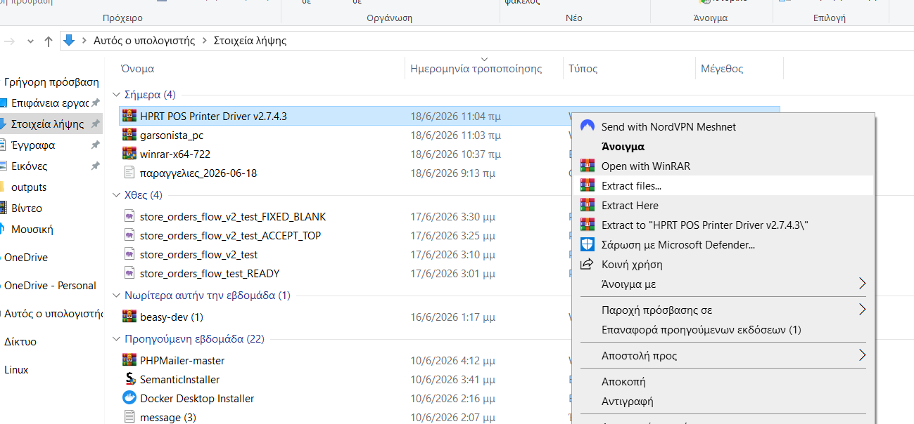

4. Στο παράθυρο **«Extraction path and options»** έλεγξε ότι η διαδρομή δείχνει
   φάκελο `HPRT POS Printer Driver`. Δεν χρειάζεται καμία άλλη αλλαγή — πάτησε
   **«OK»** κάτω δεξιά και περίμενε να ολοκληρωθεί η αποσυμπίεση.

   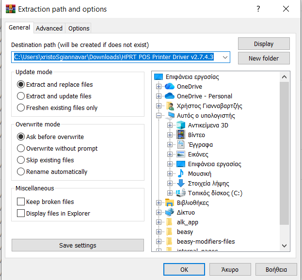

5. Στις Λήψεις εμφανίζεται πλέον ο φάκελος **`HPRT POS Printer Driver
   v2.7.4.3`**. Άνοιξέ τον με **διπλό κλικ**.

   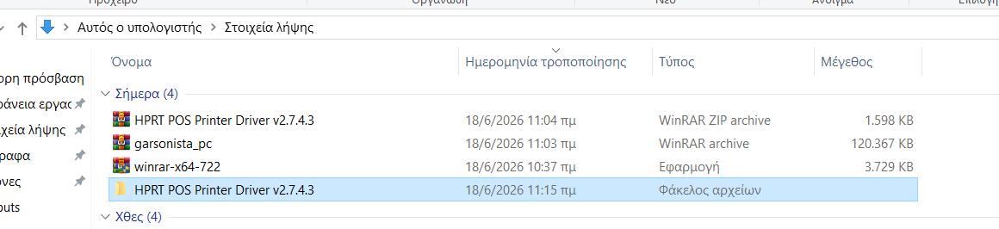

### 2.2 Εκτέλεση του προγράμματος εγκατάστασης

1. Μέσα στον φάκελο βρες το αρχείο **`HPRT POS Printer Driver v2.7.4.3`** με
   τύπο **«Εφαρμογή»** και κάνε **διπλό κλικ** — ξεκινά η εγκατάσταση.

   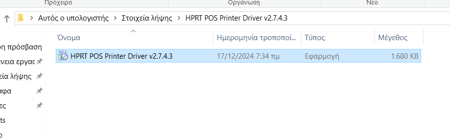

2. **Αν εμφανιστεί μπλε παράθυρο «Τα Windows προστάτευσαν τον υπολογιστή
   σας»** (SmartScreen): πάτησε **«Περισσότερες πληροφορίες»** — **όχι** το «Να
   μην γίνει εκτέλεση», γιατί ακυρώνει την εγκατάσταση.

   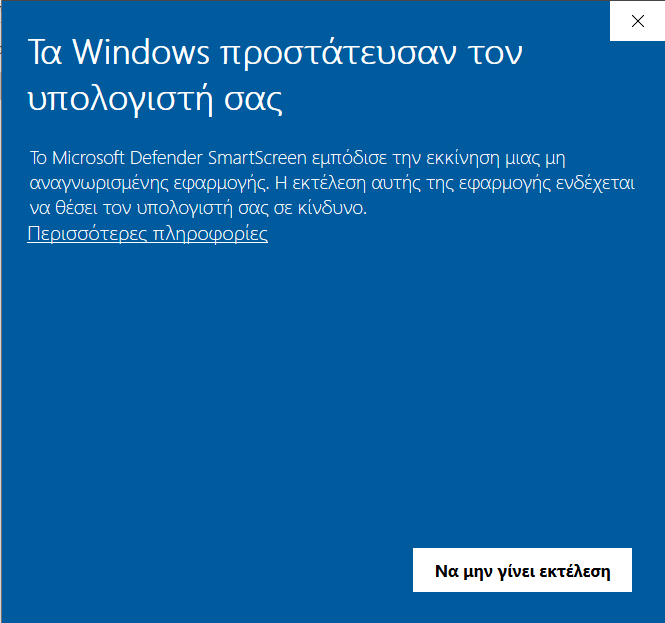

3. Στη συνέχεια εμφανίζεται το κουμπί **«Εκτέλεση»** (ή «Εκτέλεση όπως και να
   'χει») — πάτησέ το. Αν στο δικό σου PC δεν εμφανιστεί καθόλου SmartScreen,
   συνέχισε στο επόμενο βήμα.

   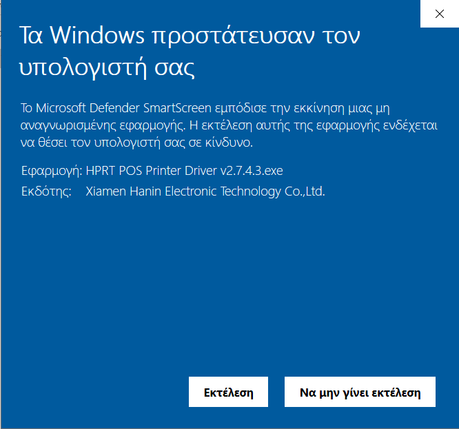

4. Στον **«Έλεγχο λογαριασμού χρήστη»** τα Windows ρωτούν αν επιτρέπεις στην
   εφαρμογή να κάνει αλλαγές. Έλεγξε ότι αναφέρεται **HPRT POS Printer Driver
   Setup** και πάτησε **«Ναι»**. (Αν πατήσεις «Όχι», η εγκατάσταση δεν
   προχωράει.)

   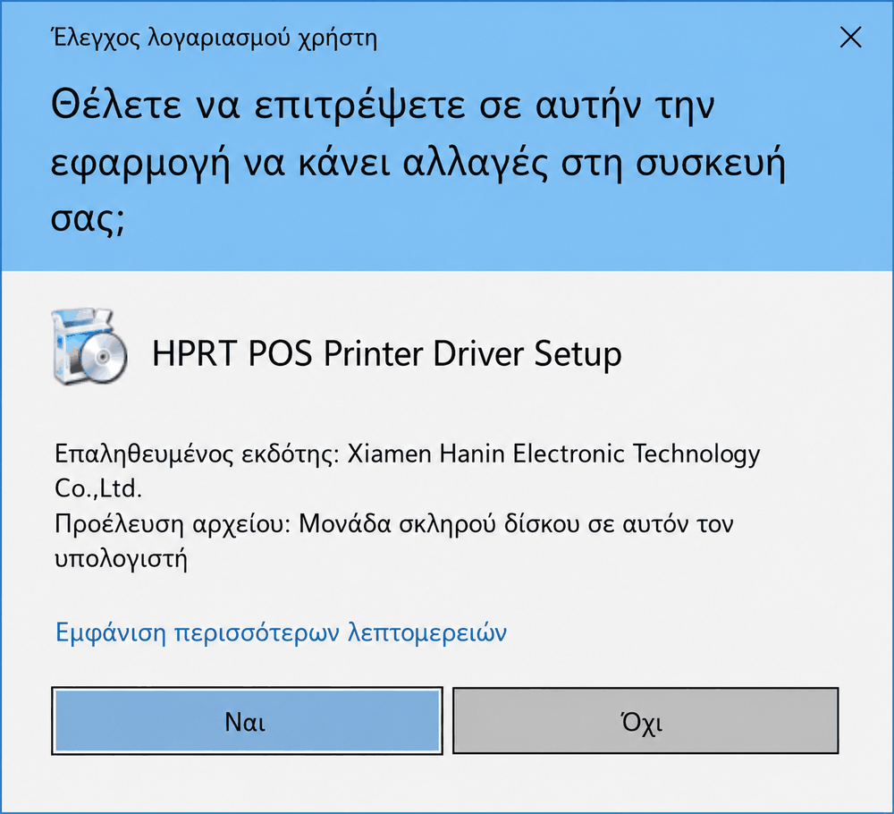

### 2.3 Οδηγός εγκατάστασης (wizard)

1. **«Select Setup Language»**: άφησε **English** και πάτησε **«OK»** (όχι
   Cancel).

   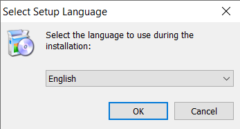

2. **«Select operation of install»**: βεβαιώσου ότι είναι επιλεγμένο το
   **«Install printer driver»** (αν όχι, πάτησε τον μικρό κύκλο αριστερά του)
   και πάτησε **«Next >»**.

   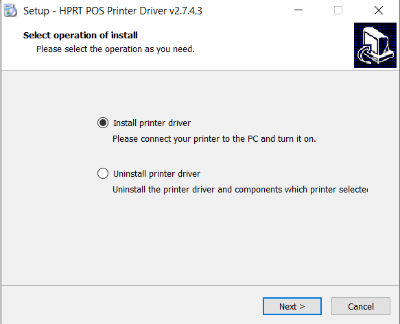

3. **«Select the port of printer driver»** — το σημαντικότερο βήμα. Πριν
   συνεχίσεις, ο εκτυπωτής πρέπει να είναι **συνδεδεμένος και ανοιχτός**:
   - **Θύρα (λίστα αριστερά):**
     - Εκτυπωτής **USB** → επίλεξε τη διαθέσιμη USB θύρα, π.χ. **USB001**,
       **USB002** ή **USB003**.
     - Εκτυπωτής **δικτύου / Ethernet** → επίλεξε την **IP του εκτυπωτή** από
       τη λίστα. Αν δεν εμφανίζεται, πάτησε **«Add TCP/IP Port»** και πρόσθεσέ
       την.
   - **«Printer Model»**: επίλεξε **TP80K**.
   - **«Pre-install Driver Name»**: άφησε **TP80K**. Αυτό είναι το **όνομα του
     εκτυπωτή** που θα δηλώσεις μετά στο Garsonista (ενότητα 4). Αν θέλεις
     οπωσδήποτε δικό σου όνομα, γράψε **μόνο λατινικούς χαρακτήρες, χωρίς κενά
     και χωρίς ειδικά σύμβολα**.
   - Πάτησε **«Next >»**.

   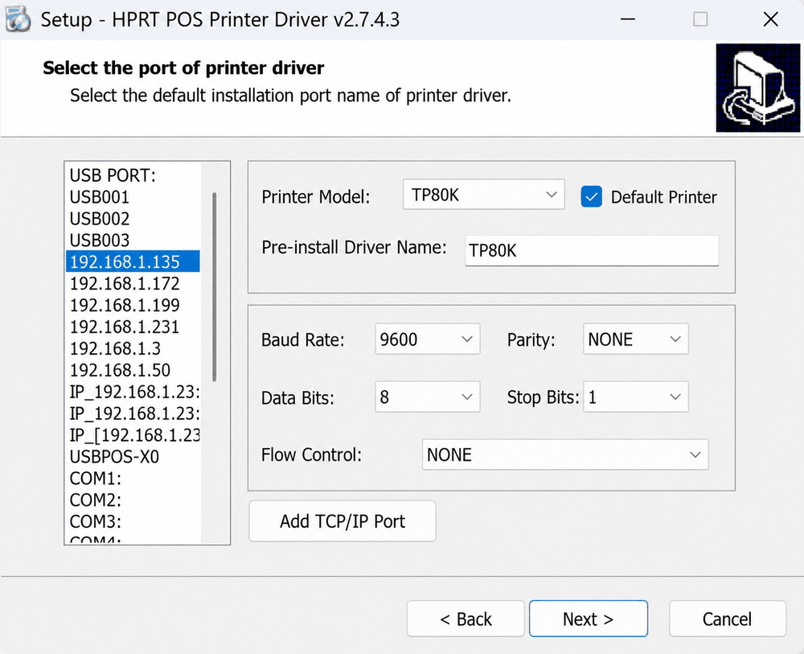

   > **Προσοχή:** Προτεινόμενο είναι να **αφήσεις το όνομα TP80K**, για να
   > είναι πιο εύκολη η δήλωση στο Garsonista.

4. **«Completing the HPRT POS Printer Driver Setup Wizard»**: πάτησε
   **«Finish»**. Ο driver **TP80K** έχει εγκατασταθεί στα Windows.

   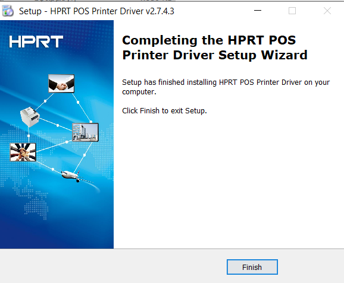

---

## 3. Ρυθμίσεις του εκτυπωτή στα Windows (χαρτί & εξοικονόμηση χαρτιού)

> **Γιατί χρειάζεται:** χωρίς αυτές τις ρυθμίσεις, το Garsonista μπορεί να
> τυπώνει σε λάθος μέγεθος χαρτιού — οι αποδείξεις **κόβονται στο πλάι**, ή
> βγαίνει **μεγάλο λευκό κενό** πάνω/κάτω σε κάθε απόδειξη.
>
> Η ρύθμιση γίνεται σε **δύο σημεία που μοιάζουν πολύ, αλλά δεν είναι το ίδιο**:
> πρώτα στις **«Προτιμήσεις εκτύπωσης»** (καρτέλα «Γενικά») και μετά στις
> **«Προεπιλογές εκτύπωσης»** (καρτέλα «Για προχωρημένους»). Και στα δύο πρέπει
> να βάλεις τα ίδια: **Paper Name: 72mm \* 3276mm** και **Advanced → Save
> Paper → Top Bottom**.

### 3.1 Άνοιγμα των ιδιοτήτων του εκτυπωτή TP80K

1. Πάτησε το πλήκτρο **Windows** στο πληκτρολόγιο (ή την **«Έναρξη»** κάτω
   αριστερά).

   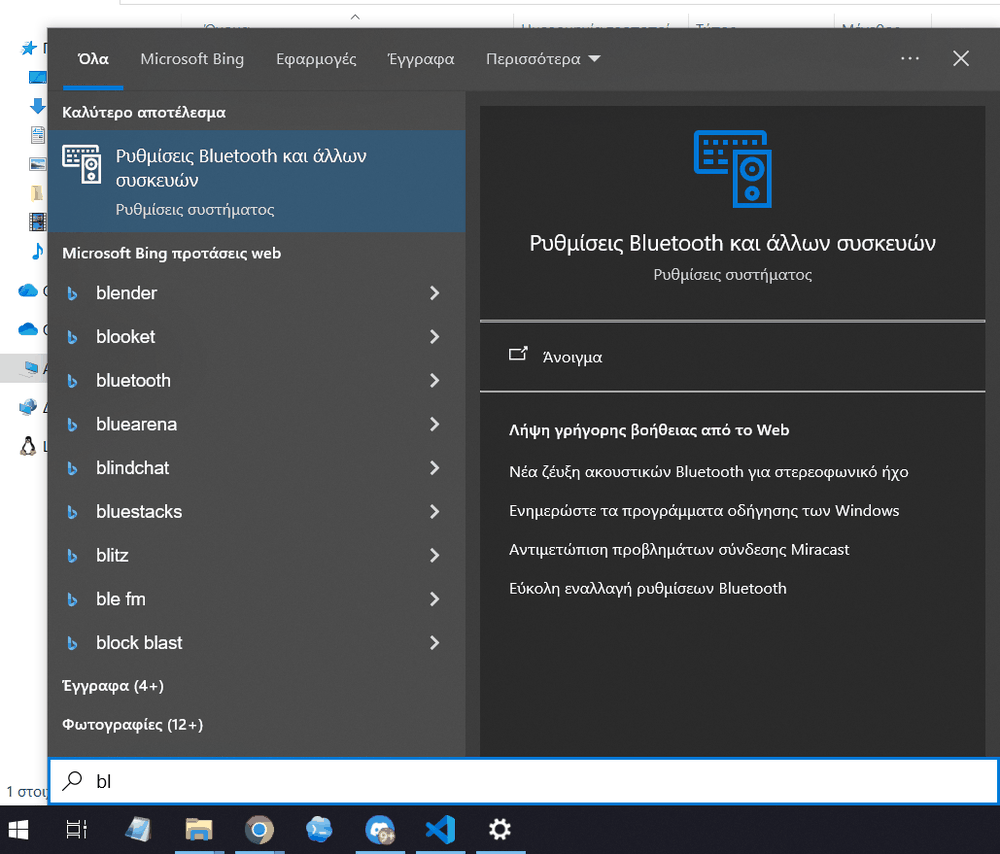

2. Στο πεδίο αναζήτησης γράψε **«Εκτυπωτές και σαρωτές»** και πάτησε το
   αποτέλεσμα **«Εκτυπωτές και σαρωτές»**. Ανοίγει η οθόνη με τους
   εγκατεστημένους εκτυπωτές.

   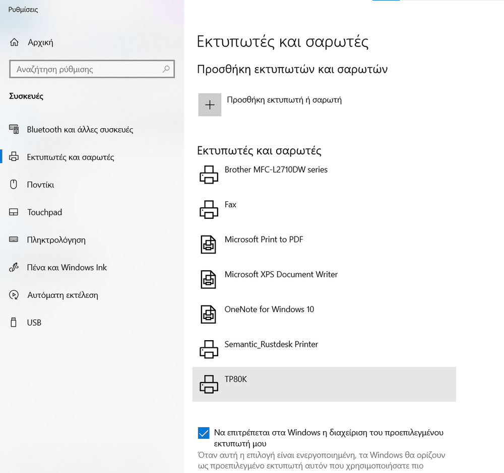

3. Στη λίστα βρες τον **TP80K** και πάτησε πάνω του (ή στο κουμπί
   **«Διαχείριση»**, ανάλογα με την έκδοση των Windows).

   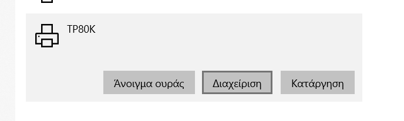

   Αν ο TP80K **δεν εμφανίζεται** στη λίστα, η εγκατάσταση του driver δεν
   ολοκληρώθηκε σωστά ή ο εκτυπωτής δεν ήταν συνδεδεμένος — ξαναδές την
   ενότητα 2.

4. Στην οθόνη διαχείρισης του TP80K πάτησε **«Ιδιότητες εκτυπωτή»**. Ανοίγει
   ξεχωριστό παράθυρο με τίτλο **«Ιδιότητες: TP80K»**.

   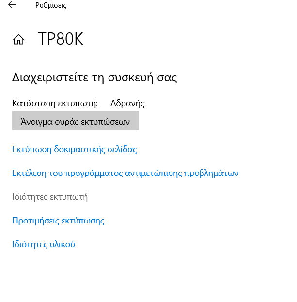

### 3.2 «Προτιμήσεις εκτύπωσης» (καρτέλα «Γενικά»)

1. Στο παράθυρο **«Ιδιότητες: TP80K»** βεβαιώσου ότι είσαι στην καρτέλα
   **«Γενικά»** (πάνω αριστερά) και πάτησε το κουμπί **«Προτιμήσεις…»** (χαμηλά
   στο παράθυρο). Ανοίγει το παράθυρο **«Προτιμήσεις εκτύπωσης: TP80K»**.

   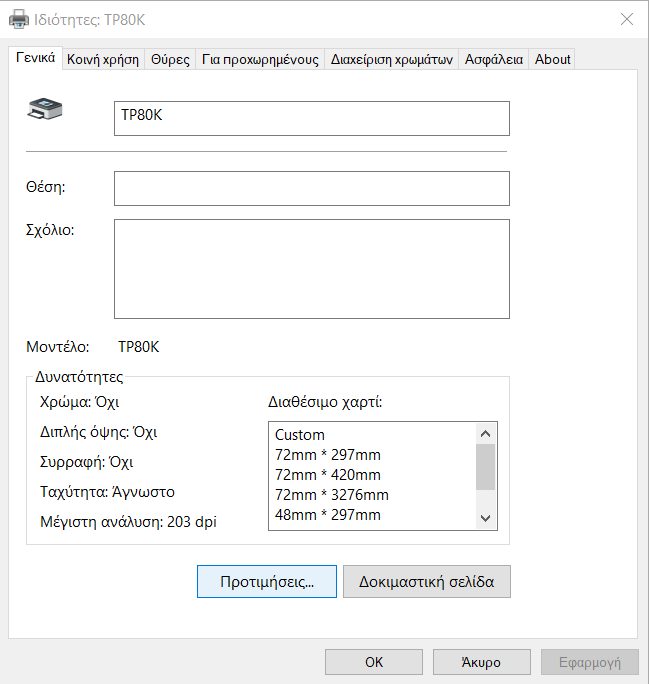

2. Στην καρτέλα **«Page»**, στο πεδίο **«Paper Name»** πρέπει να φαίνεται
   **72mm \* 3276mm**. Αν όχι, πάτησε το βελάκι δεξιά του πεδίου και επίλεξέ το
   από τη λίστα. Μετά πάτησε το κουμπί **«Advanced»** (χαμηλά δεξιά).

   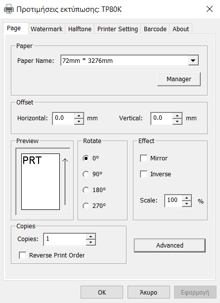

3. Στο παράθυρο **«Advanced Setting»**, στην καρτέλα **«Save Paper»**, επίλεξε
   **«Top Bottom»** (ο μικρός κύκλος αριστερά του πρέπει να είναι γεμάτος) και
   πάτησε **«OK»**.

   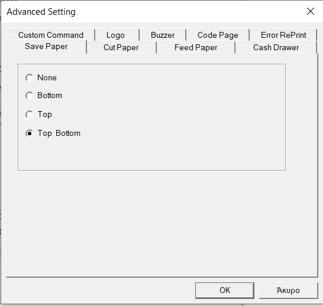

4. Επιστρέφεις στο **«Προτιμήσεις εκτύπωσης: TP80K»** — πάτησε **«OK»** για να
   αποθηκευτεί η ρύθμιση.

### 3.3 «Προεπιλογές εκτύπωσης» (καρτέλα «Για προχωρημένους»)

1. Πίσω στο παράθυρο **«Ιδιότητες: TP80K»**, πάτησε την καρτέλα **«Για
   προχωρημένους»** και μετά το κουμπί **«Προεπιλογές εκτύπωσης…»** (κάτω
   μέρος, αριστερά προς το κέντρο). Ανοίγει το παράθυρο **«TP80K Προεπιλογές
   εκτύπωσης»**.

   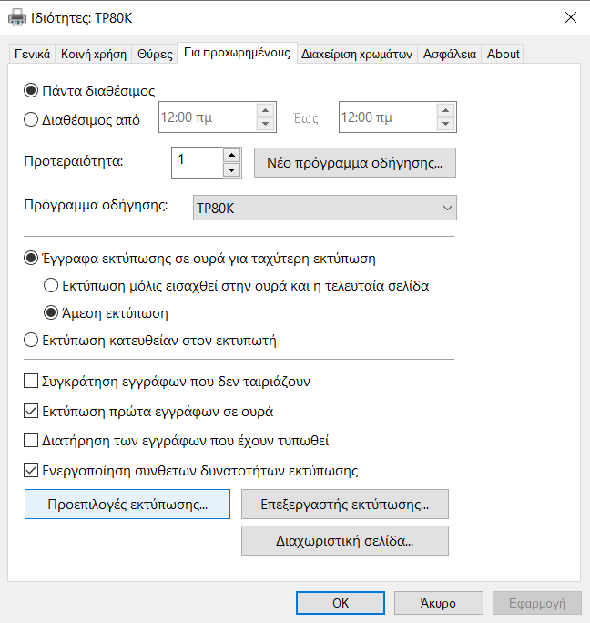

2. Στην καρτέλα **«Page»**, στο **«Paper Name»** επίλεξε ξανά **72mm \*
   3276mm** και πάτησε **«Advanced»**.

   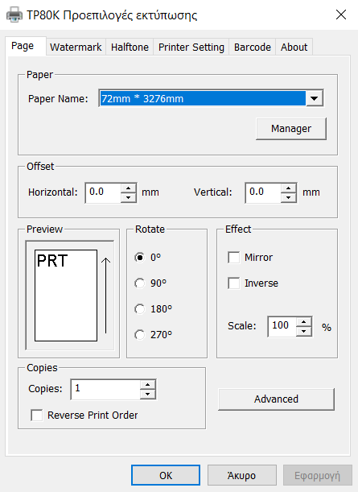

3. Στο **«Advanced Setting»** → καρτέλα **«Save Paper»** → **«Top Bottom»** →
   **«OK»**.

   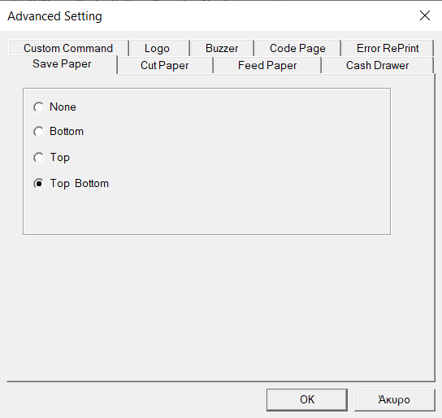

4. Πάτησε **«OK»** στο «TP80K Προεπιλογές εκτύπωσης» και τέλος **«OK»** στο
   «Ιδιότητες: TP80K» για να κλείσει το παράθυρο ιδιοτήτων.

> **Μην κλείνεις τα παράθυρα με το «Χ»** επάνω δεξιά αν δεν έχεις πατήσει πρώτα
> «OK» — αλλιώς οι ρυθμίσεις **δεν αποθηκεύονται**.

---

## 4. Δήλωση του εκτυπωτή στο Garsonista Ταμειακή (`defparams.txt`)

> **Τι κάνουμε εδώ:** το Garsonista Ταμειακή πρέπει να ξέρει **σε ποιον
> εκτυπωτή** θα στέλνει αποδείξεις, παραγγελίες και λογαριασμούς. Το όνομα του
> εκτυπωτή (όπως τον βλέπουν τα Windows — **TP80K**) γράφεται στο αρχείο
> ρυθμίσεων **`defparams.txt`**, μέσα στον φάκελο του προγράμματος.

### 4.1 Άνοιγμα του αρχείου `defparams`

1. Άνοιξε τον **φάκελο εγκατάστασης** του Garsonista. Προεπιλογή είναι ο
   **`C:\Garsonista`**· σε παλαιότερες εγκαταστάσεις ο **`C:\garsonista_pc`**
   (αν μέσα του υπάρχει δεύτερος φάκελος `garsonista_pc`, άνοιξε και αυτόν).
2. Στη λίστα αρχείων βρες το **`defparams`** (τύπος **«Έγγραφο κειμένου»** —
   τα Windows συνήθως κρύβουν την κατάληξη `.txt`).
3. Κάνε **διπλό κλικ** — ανοίγει με το **Σημειωματάριο** (Notepad).

   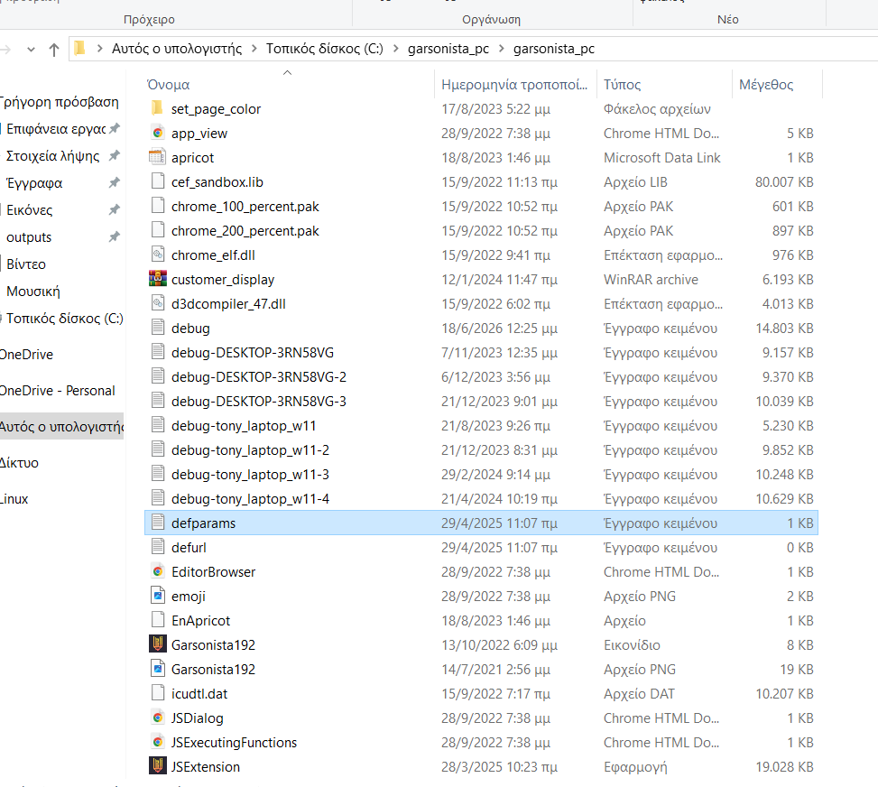

### 4.2 Γραμμή `paroxos_printer` (εκτυπωτής παραστατικών)

1. Στις πρώτες γραμμές του αρχείου βρες τη γραμμή **`paroxos_printer=`**.
2. Μετά το `=` γράψε **ακριβώς** το όνομα του εκτυπωτή όπως το άφησες στην
   εγκατάσταση του driver. Με το προτεινόμενο όνομα, η σωστή γραμμή είναι:

   ```
   paroxos_printer=TP80K
   ```

3. **Χωρίς κενά** πριν ή μετά το όνομα: **όχι** `paroxos_printer= TP80K`, **όχι**
   `paroxos_printer=TP80K ` (με κενό στο τέλος).

   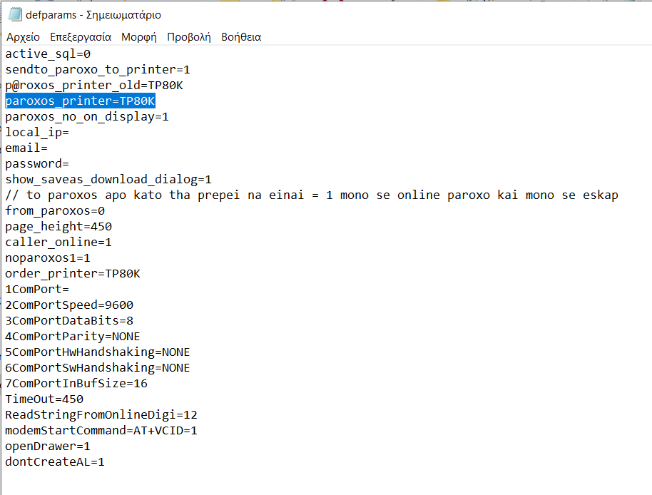

### 4.3 Γραμμή `order_printer` (γενικός εκτυπωτής)

1. Λίγο πιο κάτω στο ίδιο αρχείο βρες τη γραμμή **`order_printer=`**.
2. Μετά το `=` γράψε **το ίδιο ακριβώς όνομα**:

   ```
   order_printer=TP80K
   ```

   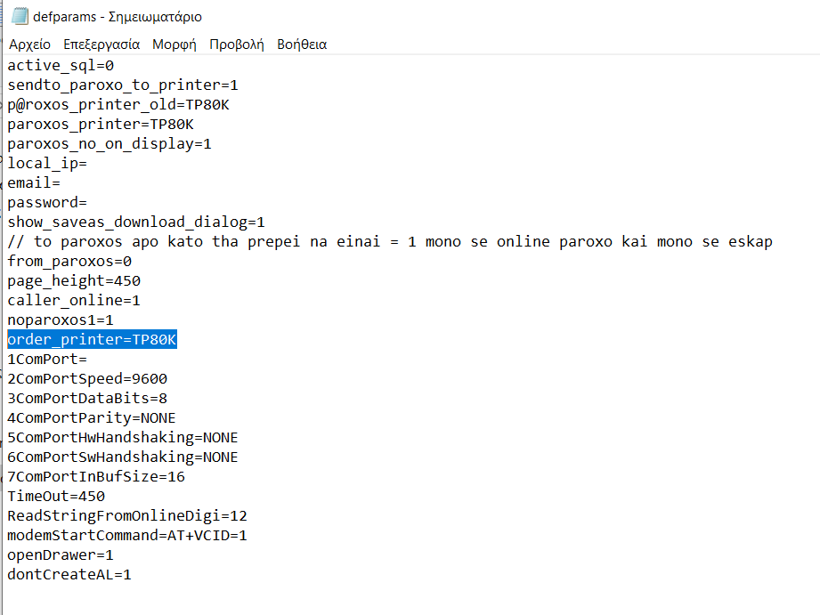

3. Οι δύο γραμμές που μας ενδιαφέρουν πρέπει τελικά να είναι:

   ```
   paroxos_printer=TP80K
   order_printer=TP80K
   ```

4. Αν στην εγκατάσταση του driver έβαλες **διαφορετικό** «Pre-install Driver
   Name», γράφεις **εκείνο** το όνομα αντί για TP80K — **και στις δύο** γραμμές.
5. **Αποθήκευση:** πάτησε **Ctrl + S** (ή **«Αρχείο» → «Αποθήκευση»**) και
   κλείσε το Notepad.
6. **Κλείσε και ξανάνοιξε το Garsonista Ταμειακή** — το αρχείο διαβάζεται στην
   εκκίνηση του προγράμματος.

> **Έλεγχος:** το όνομα στο `defparams` πρέπει να είναι ίδιο **χαρακτήρα προς
> χαρακτήρα** με το όνομα του εκτυπωτή στις «Εκτυπωτές και σαρωτές» των
> Windows. Αν στα Windows λέγεται TP80K, γράφουμε TP80K και στις δύο γραμμές.

---

## 5. Συχνά προβλήματα & λύσεις

| Σύμπτωμα | Αιτία | Λύση |
|---|---|---|
| Ο TP80K δεν εμφανίζεται στις «Εκτυπωτές και σαρωτές» | Η εγκατάσταση ακυρώθηκε (SmartScreen «Να μην γίνει εκτέλεση» ή «Όχι» στον Έλεγχο λογαριασμού) ή ο εκτυπωτής ήταν κλειστός/αποσυνδεδεμένος | Σύνδεσε και άνοιξε τον εκτυπωτή και ξανατρέξε τον driver (ενότητα 2) |
| Στη λίστα θυρών δεν υπάρχει καμία USB θύρα | Ο εκτυπωτής δεν είναι συνδεδεμένος με USB ή είναι κλειστός | Σύνδεσε/άνοιξε τον εκτυπωτή, πάτησε «< Back» και ξανά «Next >» για να ανανεωθεί η λίστα |
| Δικτυακός εκτυπωτής: η IP του δεν εμφανίζεται στη λίστα | Ο εκτυπωτής είναι σε άλλο δίκτυο ή δεν έχει ανιχνευθεί | Πάτησε «Add TCP/IP Port» και γράψε την IP από το self-test του εκτυπωτή· έλεγξε ότι PC και εκτυπωτής είναι στο ίδιο router |
| Το Garsonista δεν τυπώνει τίποτα, χωρίς μήνυμα λάθους | Το όνομα στο `defparams.txt` δεν ταιριάζει με το όνομα του εκτυπωτή στα Windows (κενό, λάθος γράμμα, ελληνικοί χαρακτήρες) | Άνοιξε το `defparams.txt` και διόρθωσε τις γραμμές `paroxos_printer` και `order_printer` ώστε να είναι **ακριβώς** TP80K, χωρίς κενά· επανεκκίνηση του Garsonista |
| Η απόδειξη βγαίνει κομμένη στο πλάι | Λάθος «Paper Name» | Ρύθμισε **72mm \* 3276mm** και στις «Προτιμήσεις εκτύπωσης» και στις «Προεπιλογές εκτύπωσης» (ενότητα 3) |
| Μεγάλο λευκό κενό πάνω ή κάτω σε κάθε απόδειξη / σπατάλη χαρτιού | Δεν έχει επιλεγεί «Save Paper → Top Bottom» | Ρύθμισε **Advanced → Save Paper → Top Bottom** και στα δύο σημεία (ενότητα 3) |
| Έκανα τις ρυθμίσεις αλλά «χάθηκαν» | Τα παράθυρα έκλεισαν με το «Χ» αντί για «OK» | Ξανακάνε τις ρυθμίσεις της ενότητας 3 και κλείσε **κάθε** παράθυρο με «OK» |
| Οι ρυθμίσεις έγιναν στις «Προτιμήσεις» αλλά το πρόβλημα παραμένει | Το Garsonista χρησιμοποιεί τις «Προεπιλογές εκτύπωσης» | Ρύθμισε **και** τις «Προεπιλογές εκτύπωσης» από την καρτέλα «Για προχωρημένους» (ενότητα 3.3) |
| Άλλαξα το `defparams.txt` αλλά δεν άλλαξε τίποτα | Το αρχείο διαβάζεται στην εκκίνηση | Κλείσε και ξανάνοιξε το Garsonista Ταμειακή |

---

## 6. Για τεχνικούς [ΤΕΧΝΙΚΟΣ]

- **Ένας driver για πολλούς εκτυπωτές:** ο HPRT POS Printer Driver με μοντέλο
  **TP80K** καλύπτει τους HPRT 80mm και τους περισσότερους γενικούς θερμικούς
  **POS80** (ESC/POS). Δεν χρειάζεται ο driver του κατασκευαστή, εκτός αν ο
  εκτυπωτής **δεν τυπώνει καθόλου** με τον TP80K — τότε δοκίμασε τον δικό του
  driver και δήλωσε στο `defparams.txt` το όνομα που θα έχει εκείνος.
- **Το όνομα του εκτυπωτή είναι το κλειδί:** ό,τι γραφτεί στο «Pre-install
  Driver Name» γίνεται το όνομα του εκτυπωτή στα Windows και πρέπει να
  ταυτίζεται χαρακτήρα προς χαρακτήρα με τα `paroxos_printer` / `order_printer`.
  Κράτα το **TP80K** (λατινικά, χωρίς κενά).
- **Δεύτερος εκτυπωτής (π.χ. κουζίνα):** εγκατάστασέ τον με τον ίδιο driver,
  αλλά με **διαφορετικό** «Pre-install Driver Name» (π.χ. `TP80K2` ή
  `KOUZINA`) και διαφορετική θύρα/IP. Στο Garsonista Ταμειακή ο εκτυπωτής
  παραστατικών παραμένει ο `paroxos_printer`. Οι εκτυπωτές παραγγελιών ανά
  πόστο δηλώνονται με τις γραμμές `order_printer01`, `order_printer02` κ.ο.κ.,
  με τη σειρά που έχουν οριστεί στο «Διαχειριστικό → Εκτυπωτές» — αναλυτικά
  στην ενότητα «Ρυθμίσεις του Windows app — αρχείο defparams.txt» του
  [WEB_PRINT_SERVICE.md](WEB_PRINT_SERVICE.md).
- **Δικτυακοί εκτυπωτές:** δώσε **στατική IP** στον εκτυπωτή (ή DHCP
  reservation στο router), αλλιώς μετά από επανεκκίνηση του router η θύρα του
  driver δείχνει σε λάθος IP και ο εκτυπωτής «σταματάει» χωρίς μήνυμα.
- **Επανεγκατάσταση / αλλαγή PC:** ξανατρέχεις τον driver με τις ίδιες
  επιλογές και ελέγχεις ότι το `defparams.txt` έχει το ίδιο όνομα εκτυπωτή —
  δεν χρειάζεται καμία ενέργεια στο adminpanel.
