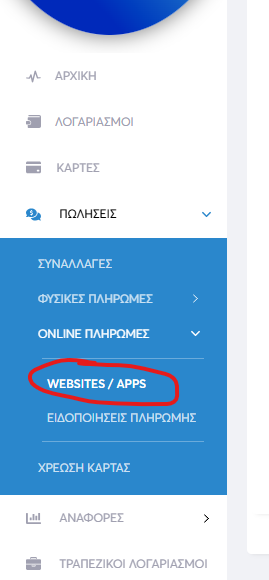
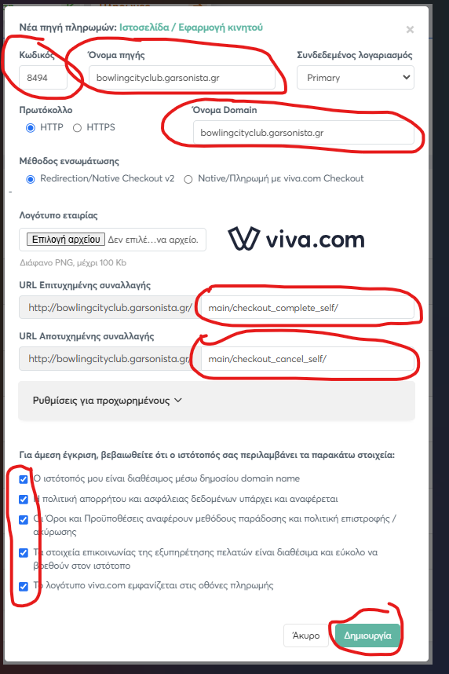
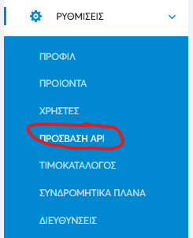
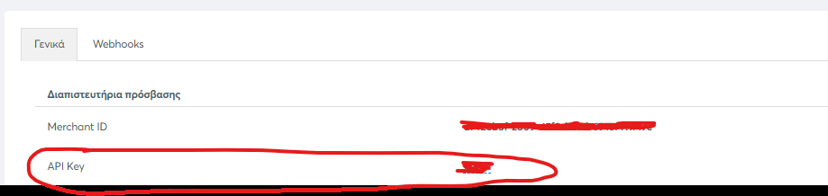

# Εγχειρίδιο — Σύνδεση QR Menu & Online Delivery με Viva

> Για να δέχεται το κατάστημα **online πληρωμές με κάρτα** (στο QR Menu και
> στο Online Delivery), πρέπει ο λογαριασμός Viva της επιχείρησης να συνδεθεί
> με το Garsonista. Η διαδικασία έχει δύο μέρη: (α) δημιουργία «πηγής
> πληρωμών» μέσα στο **περιβάλλον της Viva** και (β) καταχώρηση των τριών
> στοιχείων που προκύπτουν στις **Ρυθμίσεις QR Menu** του Garsonista.
>
> Χρειάζεται πρόσβαση στον **λογαριασμό Viva της επιχείρησης**
> (viva.com self-care).

---

## 1. Τι θα χρειαστεί να βγάλουμε από τη Viva

Στο τέλος της διαδικασίας πρέπει να έχουμε σημειώσει **τρία στοιχεία**:

1. τον **«Κωδικό»** της πηγής πληρωμών (βγαίνει αυτόματα στο βήμα §2),
2. το **Merchant ID** (§3),
3. το **API Key** (§3).

Αυτά τα τρία καταχωρούνται μετά στο Garsonista (§4). Αν το σετάρισμα το κάνει
ο τεχνικός Garsonista, ο πελάτης απλώς τού δίνει αυτά τα τρία στοιχεία.

---

## 2. Βήμα 1 — Δημιουργία πηγής πληρωμών στη Viva

1. Σύνδεση στο περιβάλλον διαχείρισης της Viva (viva.com).
2. Από το αριστερό μενού: **«ΠΩΛΗΣΕΙΣ» → «ONLINE ΠΛΗΡΩΜΕΣ» → «WEBSITES /
   APPS»**:

   

3. Δημιουργούμε **νέα πηγή πληρωμών** τύπου **«Ιστοσελίδα / Εφαρμογή
   κινητού»**. Στη φόρμα που ανοίγει συμπληρώνουμε:

   

   - **«Όνομα πηγής»** και **«Όνομα Domain»**: το domain του site παραγγελιών.
     **SOS**: στη θέση του «bowlingcityclub» που φαίνεται στην εικόνα βάζουμε
     **«sites»** — δηλαδή `sites.garsonista.gr`.
   - **«Πρωτόκολλο»**: επιλέγουμε **HTTPS** — **ΟΧΙ** το HTTP που είναι
     προτσεκαρισμένο (και φαίνεται τσεκαρισμένο στην εικόνα).
   - **«URL Επιτυχημένης συναλλαγής»**: `main/checkout_complete_self/`
   - **«URL Αποτυχημένης συναλλαγής»**: `main/checkout_cancel_self/`
   - Τσεκάρουμε και τα **πέντε checkbox** της ενότητας «Για άμεση έγκριση,
     βεβαιωθείτε ότι ο ιστότοπός σας περιλαμβάνει τα παρακάτω στοιχεία».
4. Πατάμε **«Δημιουργία»**.
5. Ο **«Κωδικός»** της πηγής (πάνω αριστερά στη φόρμα) **δεν συμπληρώνεται
   από εμάς** — τον παίρνει αυτόματα η Viva με τη δημιουργία. **Τον
   σημειώνουμε**: είναι το πρώτο από τα τρία στοιχεία που θα χρειαστούν στο
   Garsonista.

---

## 3. Βήμα 2 — Merchant ID & API Key

1. Από το αριστερό μενού της Viva: **«ΡΥΘΜΙΣΕΙΣ» → «ΠΡΟΣΒΑΣΗ API»**:

   

2. Στην καρτέλα **«Γενικά»**, ενότητα **«Διαπιστευτήρια πρόσβασης»**,
   σημειώνουμε το **Merchant ID** και το **API Key**:

   

---

## 4. Βήμα 3 — Καταχώρηση στο Garsonista

Στο **Διαχειριστικό → Ρυθμίσεις QR Menu**, ενότητα **«Viva Payment»**
(βλ. και εγχειρίδιο [QR_MENU.md](QR_MENU.md), §3.3):

1. Συμπληρώνουμε τα τρία στοιχεία στα αντίστοιχα πεδία:
   - **«viva_Merchant_ID»** → το Merchant ID (§3)
   - **«viva_API_Key»** → το API Key (§3)
   - **«viva_code»** → ο «Κωδικός» της πηγής πληρωμών (§2)
2. Πατάμε αποθήκευση στην ενότητα.

Χρήσιμα για τα πεδία αυτά:

- Merchant ID και API Key αποθηκεύονται **κρυπτογραφημένα και δεν
  εμφανίζονται ξανά** — βλέπεις μόνο «Έχει οριστεί» / «Δεν έχει οριστεί».
  Για αλλαγή συμπληρώνεις νέα τιμή· **κενό πεδίο = κρατιέται η υπάρχουσα**.
- Τα στοιχεία Viva μπορεί να τα αλλάξει **μόνο ο κύριος χρήστης** του
  καταστήματος.
- Τα **ίδια στοιχεία** εξυπηρετούν και το QR Menu και το Online Delivery —
  η σύνδεση γίνεται **μία φορά**.

Από εδώ και πέρα, στο checkout του πελάτη εμφανίζεται η επιλογή **«Κάρτα»**
και οι πληρωμές περνούν από τη Viva του καταστήματος.

---

## 5. Συχνά προβλήματα & λύσεις

| Σύμπτωμα | Αιτία | Λύση |
|---|---|---|
| Δεν βγαίνει επιλογή «Κάρτα» στον πελάτη | Δεν έχουν καταχωρηθεί τα στοιχεία Viva, ή δεν είναι τσεκαρισμένη η «Κάρτα» στους Τρόπους Πληρωμής | Ολοκλήρωσε το §4 και τσέκαρε την «Κάρτα» στις Ρυθμίσεις QR Menu |
| Η πληρωμή αποτυγχάνει πάντα / ο πελάτης γυρνάει σε σελίδα σφάλματος | Λάθος στοιχεία στην πηγή πληρωμών της Viva (πρωτόκολλο ή URLs) | Έλεγξε στη Viva: **HTTPS** (όχι HTTP) και τα δύο URLs ακριβώς όπως στο §2 |
| Η πηγή πληρωμών στη Viva δεν εγκρίνεται | Δεν τσεκαρίστηκαν τα 5 checkbox «άμεσης έγκρισης», ή το site δεν πληροί κάποιο από αυτά | Τσέκαρέ τα και επικοινώνησε με τη Viva αν η έγκριση καθυστερεί |
| «Έχασα» το Merchant ID / API Key που είχα καταχωρήσει | Σκόπιμο — αποθηκεύονται κρυπτογραφημένα και δεν επανεμφανίζονται | Βγάλε τα ξανά από τη Viva (§3) και καταχώρησέ τα από την αρχή |
| Δεν μπορώ να αλλάξω τα στοιχεία Viva στις Ρυθμίσεις QR Menu | Δεν είσαι ο κύριος χρήστης του καταστήματος | Η αλλαγή γίνεται μόνο από τον κύριο χρήστη (ή ζήτα το από τον τεχνικό) |
| Ο πελάτης πλήρωσε αλλά η παραγγελία «δεν φαίνεται» | Η επιβεβαίωση από τη Viva καθυστερεί | Δες το φίλτρο «Εκκρεμείς» στη Ροή Παραγγελιών — ο αυτόματος έλεγχος (κάθε 5΄) θα την περάσει μόλις επιβεβαιωθεί |

---

## 6. Για τεχνικούς [ΤΕΧΝΙΚΟΣ]

- **Σειρά**: πηγή πληρωμών στη Viva (§2) → Merchant ID/API Key (§3) →
  καταχώρηση στις «Ρυθμίσεις QR Menu → Viva Payment» (§4). Αν τη Viva τη
  χειρίζεται ο πελάτης, ζήτα του τα **τρία στοιχεία** (Κωδικός, Merchant ID,
  API Key).
- **Τα κλασικά λάθη** στη φόρμα της Viva: μένει το **HTTP** προτσεκαρισμένο
  (θέλει HTTPS), και λάθος/ελλιπή URLs επιτυχίας-αποτυχίας. Τα URLs
  συμπληρώνονται **μετά** το domain, ακριβώς: `main/checkout_complete_self/`
  και `main/checkout_cancel_self/`.
- **Domain**: `sites.garsonista.gr` (στη θέση του παραδείγματος της εικόνας).
- **Ευαίσθητα στοιχεία**: Merchant ID/API Key κρυπτογραφούνται και δεν
  επανεμφανίζονται — μην τα αποθηκεύεις σε άλλα σημεία, και μην τα στέλνεις
  σε ομαδικές συζητήσεις.
- **Τεκμηρίωση (developers)**: φάκελος `docs/` του repo.
